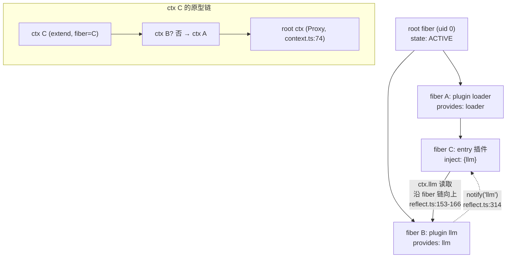
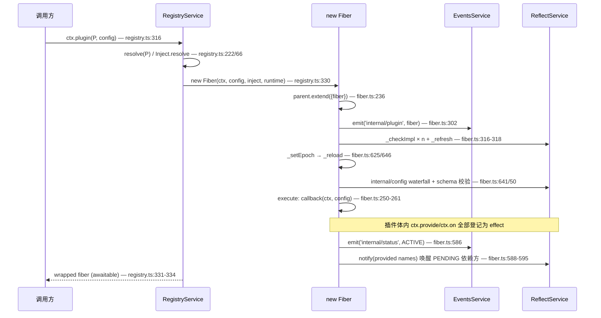

# Cordis 内核研究笔记

> 分析对象：DeepSeek Harness 仓库 `/Users/bytedance/codes/open-source/deepseek-harness`
> 源码位置：`vendor/cordis/src/`（TS 源码，上游 cordis 4.0.0-rc.7 的 fork，见 `vendor/README.md` 清单）
> 配套文档：`docs/cordis-primer.zh.md`、`docs/event-producer-consumer.zh.md`、`docs/architecture.zh.md`
> 下文所有 `路径:行号` 均指向该仓库内的真实源码行，已用 rg 逐一核对。

## 一句话定位

Cordis 是一个「元框架」：它把整个应用建模为**一棵 fiber（插件运行实例）树**，树上每个节点持有一个被 Proxy 包裹的 Context，属性读取即服务解析、插件副作用全部登记为可逆 effect——于是「加载顺序」由依赖声明推导、「卸载/热重载」由 disposer 链自动完成。

## 关键文件地图

| 文件 | 职责 | 教学价值 |
|---|---|---|
| `vendor/cordis/src/context.ts` | Context 类：`extend`/`isolate`/`intercept` 三个作用域构造器；根 Context 构造函数里装 Proxy 与五大内建服务（context.ts:71-83） | 最小入口，先读它建立整体图景 |
| `vendor/cordis/src/reflect.ts` | Proxy handler（reflect.ts:135）＋服务注册表 `store`/`props`＋`provide`/`notify`/`mixin` | 全仓库信息密度最高的文件，「属性访问即服务解析」在这里 |
| `vendor/cordis/src/registry.ts` | 插件三种形态的归一化（registry.ts:222）、`ctx.plugin()` 入口（registry.ts:316）、`Inject` 声明与装饰器 | 理解「什么算一个插件」 |
| `vendor/cordis/src/fiber.ts` | Fiber 状态机（fiber.ts:147）、effect/disposer 机制（fiber.ts:418）、`_reload`/`_unload`（fiber.ts:646/675） | 生命周期与「可逆副作用」的核心，最难也最值得读 |
| `vendor/cordis/src/events.ts` | 五种分发模式＋`internal/*` 内建事件契约（events.ts:326-352） | 事件系统全部语义一页看完 |
| `vendor/cordis/src/service.ts` | `Service` 基类：构造即 `provide`（service.ts:57）、intercept 配置合并（service.ts:86） | 写服务时对照读 |
| `vendor/cordis/src/utils.ts` | `getTraceable`/shadow ctx（utils.ts:117/165）、`DisposableList`、长栈拼接 `composeError` | 第二遍再细读；第一遍可跳过栈拼接部分 |
| `vendor/loader/src/index.ts` | `Loader` 服务：entry 树装配、`internal/config` 插值（index.ts:104）、`internal/plugin` 监听 entry 归属（index.ts:129） | 声明式装配的总控 |
| `vendor/loader/src/config/entry.ts` | 单个 entry 的 `update`/`init`/volatile 配置热更（entry.ts:118/223/170） | 「改一行 yml 如何重启一个插件」 |
| `vendor/loader/src/config/isolate.ts` | `isolate`/`intercept` entry 选项的运行时实现（isolate.ts:96-146） | 「时空可组合性」最硬核的 50 行 |
| `vendor/include/src/index.ts` | cordis.yml 文件载体：patch/`insert` 语义（index.ts:57-126）、`!!js` 表达式 | 理解 patch yml 分层覆盖 |
| `docs/cordis-primer.zh.md` | 五概念＋分发模式表＋waterfall 语义 | 读源码前的官方导读 |

## 核心机制详解

### 1. Context 是什么？Proxy 如何实现「属性访问即服务解析」

`Context` 是一个**接口 + 被 Proxy 包裹的类**。根 Context 构造时返回的不是 `this` 而是代理：

```ts
// vendor/cordis/src/context.ts:74-83
const self = new Proxy<this>(this, ReflectService.handler)
this.root = self
this.fiber = new Fiber(self, {}, Object.create(null), null, () => [])
this.reflect = new ReflectService(self)
this.registry = new RegistryService(self)
this.events = new EventsService(self)
this.logger = new LoggerService(self)
...
return self
```

- `ReflectService.handler`（reflect.ts:135）是所有 context 共享的 trap 集。
- 构造函数 `return self`（context.ts:83）：JS 构造函数返回对象会覆盖 `this`，所以根 context 从诞生起就是代理。

读属性时（reflect.ts:136-166，节选）：

```ts
get: (target, prop, ctx: Context) => {
  if (isSpecialProperty(prop)) {                    // symbol / prototype / then / 数字 / _ 开头
    return Reflect.get(target, prop, ctx)
  }
  if (Reflect.has(target, prop)) {                  // 原型链上真实存在的属性（如 extend、fiber）
    return getTraceable(ctx, Reflect.get(target, prop, ctx))
  }
  const error = new Error(`cannot get property "${prop}" without inject`)
  const def = target.reflect.props[prop]
  if (def?.type === 'accessor') {                   // mixin/accessor 声明的计算属性
    return def.get.call(ctx, ctx[symbols.receiver], error)
  }
  return ctx.events.waterfall('internal/get', ctx, prop, error, () => {
    let fiber = (ctx[symbols.shadow] ?? ctx).fiber  // 沿 fiber 链向上找
    while (true) {
      const impl = fiber.store?.[prop]
      if (impl) return getTraceable(ctx, impl.value) // 命中：返回服务实现
      ...
    }
  })
}
```

逐行要点：

1. `isSpecialProperty`（reflect.ts:86-93）把 symbol、`then`、数字键、`_` 前缀全部旁路——`_xxx` 因此成为「私有属性不经服务解析」的约定。
2. `Reflect.has(target, prop)` 命中说明是 Context 原型上的真实方法/自有属性（`ctx.extend`、`ctx.fiber`、被赋值到 target 上的 `events` 等内建服务），直接返回，但包一层 `getTraceable`（utils.ts:117）让方法调用时绑定调用方的 context。
3. 都不是，才进入服务解析：`props[prop]` 里若是 `accessor`（由 `mixin`/`accessor` 注册），走自定义 getter——`ctx.on`、`ctx.plugin` 就是这样从 `events`/`registry` 转发出来的（mixin 声明在 reflect.ts:219-222）。
4. 最后兜底是 `internal/get` waterfall 包着的**沿 fiber 链向上爬**：每个 fiber 激活时把自己可见的服务快照存在 `fiber.store`，逐级向上找，找不到就按规则抛错（详见第 5 节）。

所以「`ctx.foo`」的本质 = 一次沿 fiber 树的依赖查找 + 一层 traceable 包装。写属性同理走 `set` trap（reflect.ts:173-197），未 `provide` 的属性写会抛 `cannot set property ... without provide`。

### 2. Service 的注册与获取：`provide` / `inject` / fiber 依赖追踪

**注册**（reflect.ts:277-305）：

```ts
provide(name: string, value?: any, check?: () => boolean) {
  return this.ctx.fiber.effect(() => {          // ① 整个注册是一个 effect
    this.props[name] = { type: 'service' }      // ② 声明属性类型
    this.ctx.root[symbols.isolate][name] ??= Symbol(name)
    const key = this.ctx[symbols.isolate][name] // ③ 解析当前作用域的隔离标签
    const impl: Impl = { name, value, fiber: this.ctx.fiber, check }
    if (this.store[key]) {
      throw new Error(`service "${name}" has been registered at <${...}>`)
    }
    this.store[key] = impl                      // ④ 按标签存进全局 store
    this.ctx.fiber.store![name] = impl          // ⑤ 同时挂到 fiber 快照，供属性查找
    if (this.ctx.fiber.state === FiberState.ACTIVE) this.notify([name])
    return async () => { /* 反注册并唤醒依赖者 */ }
  }, `ctx.provide(${JSON.stringify(name)})`)
}
```

- ① `fiber.effect`（fiber.ts:418）意味着：fiber 卸载时服务自动反注册——服务生命周期 = fiber 生命周期。
- ③ `store` 的 key 不是服务名而是**隔离标签**（symbol），这是 `isolate()` 的落点。
- `notify`（reflect.ts:314-335）扫描所有 runtime 的所有 fiber，凡 `inject` 里声明了该服务名的就 `_checkImpl` 后 `_refresh`。

**获取**：`ctx.get(name)`（reflect.ts:233）无声明要求；经属性代理的获取（第 1 节）则受 inject 约束。

**依赖追踪**：fiber 构造时（fiber.ts:314-318）对 `inject` 里每个名字跑 `_checkImpl(name)`（fiber.ts:597-609：在 store 里找到 ACTIVE 的实现且 `check` 通过才记入 `_store`），然后 `_refresh`（fiber.ts:611-622）把当前依赖实现拼成 epoch 字符串 `':uid1:uid2'`；epoch 变化 → `_setEpoch`（fiber.ts:625-638）触发 `_reload` 或 `_unload`。**依赖变更 = 换 epoch = 重启插件**，这就是协作流程的闭环。

### 3. Plugin 的三种形态与生命周期

类型定义（registry.ts:88-123）：`Plugin.Function`（`(ctx, config) => any`）、`Plugin.Object`（`{ apply(ctx, config) }`）、`Plugin.Constructor`（`new (ctx, config)`）。归一化在 `resolve`（registry.ts:222-228）：函数直接用，对象取 `.apply`，其余抛错。类与函数的区分靠 `isConstructor`（utils.ts:79-90：有 prototype 且不是箭头/async/generator 函数）。

执行点在 fiber 的 runner（fiber.ts:250-261）：

```ts
execute: function () {
  if (isConstructor(runtime.callback)) {
    const instance = new runtime.callback(this.ctx, this.config)
    for (const hook of instance?.[symbols.initHooks] ?? []) hook()   // @Inject 方法装饰器
    return instance?.[symbols.init]?.()                              // Service.init 异步生成器
  } else {
    return runtime.callback(this.ctx, this.config)                   // 函数 / apply
  }
}
```

生命周期 = FiberState 状态机（fiber.ts:147-154）：`PENDING → LOADING → ACTIVE → (FAILED) → UNLOADING → DISPOSED`。

- 每次激活跑一次 `_reload`（fiber.ts:646）：解析配置 → `_execute` 执行插件体 → 插件体里返回的函数/生成器/Promise 全被当作 disposer 收集（`_execute` 对 Effect 各种形态的分派，fiber.ts:380-411）。
- 卸载跑 `_unload`（fiber.ts:675-698）：`_disposables.clear()` 逆序执行全部 disposer。
- 每个 fiber 自身又是**父 fiber 的一个 effect**（fiber.ts:265）：`this.dispose = parent.fiber.effect(...)`——所以父插件卸载会级联卸载子插件，形成 fiber 树的结构化并发式清理。
- 状态迁移发 `internal/status`（fiber.ts:586），fiber 创建/销毁发 `internal/plugin`（fiber.ts:302、121）。

### 4. 事件系统：五种分发模式与 `internal/*`

`EventsService`（events.ts）支持五种模式，官方对照表在 `docs/cordis-primer.zh.md`「分发模式」一节：

| 模式 | 实现 | 语义 |
|---|---|---|
| `emit` | events.ts:194-196 | 同步调所有监听器，**不 await** 返回的 Promise（返回值被丢弃） |
| `parallel` | events.ts:183-188 | `Promise.allSettled` 并发，聚合错误为 `AggregateError` |
| `serial` | events.ts:204-210 | 按序 await，首个 bail 值短路并返回 |
| `bail` | events.ts:217-223 | serial 的同步版；bail 值定义在 `isBailed`（events.ts:13：非 null/false/undefined） |
| `waterfall` | events.ts:234-242 | 环绕中间件：监听器收 `(...args, next)`，不调 `next()` 即**否决**内建行为 |

waterfall 的全部实现只有 9 行，值得背下来：

```ts
// vendor/cordis/src/events.ts:234-242
waterfall(...args: any[]) {
  const cbs = this.dispatch('waterfall', args)
  const inner = args.pop()            // 最后一个参数是内建行为
  const next = () => {
    const cb = cbs.shift() ?? inner   // 监听器耗尽后落到内建行为
    return cb(...args)
  }
  args.push(next)                     // next 作为最后一个参数传给每个监听器
  return next()
}
```

**waterfall 用在哪**：凡需要「包装/否决一个内核动作」的地方——代理读服务 `internal/get`（reflect.ts:153）、写服务 `internal/set`（reflect.ts:191）、配置解析 `internal/config`（fiber.ts:642）、配置更新 `internal/update`（fiber.ts:748）。harness 业务层的例子见 `docs/event-producer-consumer.zh.md`：`agent/pre-step`、`llm/stream`、`approval/request` 都是 waterfall。

**`internal/*` 与普通事件的区别**（events.ts:326-352 的 `Events` 接口）：

- 普通事件是插件间的公共契约；`internal/*` 是**内核自身行为的拦截点**，由核心服务派发，供框架级插件（loader、hmr）改写内核语义。
- `dispatch`（events.ts:169-171）对非 internal 事件会再发一个 `internal/dispatch` 元事件，internal 事件本身不发——防止无限递归。
- `internal/listener`（events.ts:140-146）是 bail 模式：`on('internal/update')` 且非 global 时**替换注册行为**，把监听器塞进 fiber 私有的 `_hooks`，配合 events.ts:148-159 的内建监听器实现「fiber 自己的 update 钩子链」。
- `on()` 注册本身也是一个 effect（events.ts:249-255 → 264-271），fiber 卸载监听器自动摘除。

另外 `dispatch` 里的 `Context.filter`（events.ts:172-176）让事件可以只发给特定 context 子树——`internal/service` 通知（reflect.ts:331-333）和 `loader/volatile-update` 都靠它做定向派发。

### 5. inject 声明如何影响服务可用性

错误产生于 proxy get 的两个分支（reflect.ts:144、159-161）：

```ts
const error = new Error(`cannot get property "${prop}" without inject`)   // reflect.ts:144
...
while (true) {
  const impl = fiber.store?.[prop]
  if (impl) return getTraceable(ctx, impl.value)
  if (prop in fiber.inject) {                                             // reflect.ts:159
    error.message = `cannot get required service "${prop}" in inactive context`
    throw error                                                           // 声明了却还没就绪
  }
  if (!fiber.runtime) throw error                                         // 爬到根仍没找到
  if (fiber.parent[symbols.isolate][prop] !== key) throw error            // 跨出隔离边界
  fiber = fiber.parent.fiber
}
```

机制分三层：

1. **编译期无约束，运行期抛错**：`ctx.foo` 只是属性访问；`foo` 若从未被任何上游 fiber `provide`，爬到根（`fiber.runtime` 为 null 的只有根 fiber）就抛 `cannot get property "foo" without inject`。
2. **声明了 inject 的错误信息不同**：沿链爬到某个 fiber，发现 `prop in fiber.inject` 但 `fiber.store` 里没有（即该 fiber 正处于 PENDING 等依赖就绪），抛 `cannot get required service "foo" in inactive context`（reflect.ts:160）——这只会发生在 PENDING fiber 提前注册的 `internal/plugin` 观察者里。
3. **inject 的另一面是拦截配置**：fiber 构造时把 `inject` 对象形式的值合入自己的 intercept 图（fiber.ts:238-245），供 `Service[symbols.resolveConfig]`（service.ts:86-101）自根向下合并配置。`Inject.resolve`（registry.ts:66-86）统一数组/对象/类继承三种声明形态。

旁路：`ctx.get(name)`（reflect.ts:233-235）和根 fiber 下的读取（reflect.ts:152）不受 inject 约束——`strict` 参数控制是否要求提供方 ACTIVE。

### 6. `ctx.config` 存在吗？配置如何传入

**不存在 `ctx.config` 这个内核 API**（全 `vendor/cordis/src` 无此属性；唯一相近的是类型幻影 `Service[symbols.config]`，service.ts:27，仅用于推导 intercept 配置类型）。配置的传递路径是：

1. 调用方把配置作为 `ctx.plugin(plugin, config)` 的**第二参数**（registry.ts:316；loader 场景是 entry 的 `config:` 字段，entry.ts:236）。
2. 原始配置存 `fiber._config`（fiber.ts:229）；每次激活时经 `internal/config` waterfall 后过 standard-schema 校验（`_resolveConfig` fiber.ts:641-643 → `resolveConfig` fiber.ts:50-60，失败抛 `ValidationError`，fiber.ts:20-40）。
3. 校验结果赋给 `fiber.config`（fiber.ts:655），并作为 `apply(ctx, config)` 的第二参数交给插件（fiber.ts:253/259）。
4. 运行期改配置走 `fiber.update(config)`（fiber.ts:736-752）：`internal/update` waterfall（可否决重启，loader 靠它写回 yml，loader index.ts:115-121）→ 重启。

Loader 还在 `internal/config` 上挂了 `!!js` 表达式插值（loader index.ts:104-113），插值以**插件自己的 ctx** 为作用域（`evaluate` 用 `with (ctx)`，loader config/utils.ts:3-8）。

### 7. Loader：cordis.yml / patch / group / isolate / insert / disabled 的装配语义

Loader 即 `@deepseek-ai/cordis-plugin-loader`（vendor/loader）。一条 entry 的字段定义在 `EntryOptions`（entry.ts:10-26）：`id`、`name`（模块说明符）、`config`、`group`、`disabled`、`inject`，加上 isolate.ts:5-10 扩展的 `intercept`、`isolate`。

- **cordis.yml 文件载体**：`Include`（vendor/include/src/index.ts:159）是 `EntryTree` 的文件后端，读 yml（`!!js` 标量解析为表达式节点，index.ts:10-17），`static inject = ['loader']`（index.ts:160）。harness 的 profile 就是一棵以 `cordis:include` 为根的 entry 树（`docs/architecture.zh.md` 第 43 行一带）。
- **patch yml**：`applyEntryPatches`（include index.ts:57-126）。每个 patch 按 `id` 定位目标 entry，其余字段覆盖；`name` 不匹配则跳过并告警（index.ts:115-118）。patch 列表按「bundle 层 → 用户层 → `--patch` overlay」顺序叠加，且输入被 `structuredClone`（index.ts:63）——不污染缓存的解析结果，保证热重载可回退。
- **insert**：patch 带 `insert` 字段时不是覆盖而是**追加**：有 `id` 则插进该 group 的 `config` 列表（index.ts:79-92），无 `id` 插到根列表末尾（index.ts:93）；插入的条目随即被索引（`buildMap(insert)`，index.ts:100），使同层后续 patch 能命中刚插入的行。
- **group**：`group: true` 的 entry 挂载 `Group` 插件（vendor/loader/src/config/group.ts:75-89），其 `config` 就是子 entry 列表；`Group` 继承 `EntryGroup`，靠 `internal/update` 监听实现子树增删（group.ts:81-83），`disabled` 语义上「group 自身永远 enabled，但祖先 disabled 会级联」（entry.ts:74-86 的 `disabled` getter 沿 entry 父链向上检查）。
- **disabled**：可以是 `!!js` 表达式，在 loader ctx 上求值（entry.ts:89-93）；禁用即 `fiber?.dispose()`（entry.ts:136-138）。另一个隐蔽入口：插件自己 `ctx.fiber.dispose()` 会被 loader 的 `internal/plugin` 监听器捕获并把 entry 标为 `disabled: true` 写回文件（loader index.ts:129-166 的 case 1-6 逐条排除）。
- **isolate / intercept**：见下节。
- **挂载**：`entry._init`（entry.ts:223-237）动态 import 模块 → `unwrapExports` 兼容 ESM/CJS → `registry.plugin(plugin, this.options.config)`。volatile 配置字段（schema 标注 `meta.volatile`）支持不重启的热提交（entry.ts:170-202 + diff.ts）。

### 8. 「时空可组合性」在代码里的体现

**空间组合**（同一时刻，不同作用域看到不同的服务/配置）：

- `ctx.isolate(name, label)`（context.ts:121-125）：复制隔离图、把 `name` 映射到新 label；`provide`/`get` 都按 label 存取（reflect.ts:287、154），于是子树里可以有同名服务的另一份实现。传相同 label 的两次 isolate **合并作用域**（context.ts:115 注释）。loader 的 `isolate` entry 选项用 `LocalRealm`（`#entryId` 后缀）/ `GlobalRealm`（`@label` 后缀）生成这些 label（isolate.ts:41-68），并在 `loader/patch-context` 里做服务迁移与定向 `notify`（isolate.ts:96-146）。
- `ctx.intercept(name, config)`（context.ts:141-145）：给子树追加该服务的拦截配置，经 `Service[symbols.resolveConfig]`（service.ts:86-101）自根向叶合并。
- 实现手段统一是**原型链**：`extend`（context.ts:99-109）`Object.create(this)` 出子 context，isolate/intercept 图都是 `Object.create(父图)` 的影子拷贝；loader 换位 entry 时直接 `Object.setPrototypeOf` 重接原型（isolate.ts:123-124），不动已运行的对象。

**时间组合**（同一位置，随依赖/配置变化重生）：

- fiber 的 epoch 机制（fiber.ts:611-638）：依赖集合变化 → 新 epoch → `_unload` 全部 disposer → `_reload` 重建——插件在不同时刻以不同依赖快照反复激活，而上下文位置不变。
- 每个 fiber 是父 fiber 的 effect（fiber.ts:265），所有注册（`provide`/`on`/`effect`）都是可逆的：这是「任意时刻任意子树可被整体撤销并重放」的基础，也是 HMR（vendor/hmr）与 `fiber.restart()`（fiber.ts:718）的底座。

## 一条端到端调用链：`ctx.plugin()` 到插件激活

以 `ctx.plugin(myPlugin, {foo: 1})` 为例：

1. `ctx.plugin` 属性读取命中 proxy get → `Reflect.has` 失败 → `props['plugin']` 是 mixin accessor（声明于 reflect.ts:221，转发逻辑 reflect.ts:364-390）→ 绑定到 `ctx.registry.plugin`。
2. `RegistryService.plugin`（registry.ts:316）：`resolve(plugin)` 归一化形态（registry.ts:222-228）→ 建/取 `Runtime` 记录（registry.ts:322-327）→ `Inject.resolve` 解析依赖声明（registry.ts:330 实参，实现 registry.ts:66-86）。
3. `new Fiber(...)`（registry.ts:330 → fiber.ts:222）：
   - `parent.extend({ fiber: this })` 造插件自己的子 context（fiber.ts:236）；
   - inject 里的拦截配置并入 intercept 图（fiber.ts:238-245）；
   - 自身作为父 fiber 的 effect 注册 disposer（fiber.ts:265）；
   - `emit('internal/plugin', this)` 发布（fiber.ts:302）——loader 在此挂上 `fiber.entry` 并补 inject（loader index.ts:129-133）；
   - 对每个依赖 `_checkImpl`（fiber.ts:316 → 597）后 `_refresh`（fiber.ts:318 → 611）。
4. `_refresh` 拼出 epoch（fiber.ts:611-622）→ `_setEpoch`（fiber.ts:625）→ 状态切 LOADING，`inertia = this._reload()`（fiber.ts:632）。
5. `_reload`（fiber.ts:646-673）：快照依赖 `this.store = {...this._store}` → `await Promise.resolve()` 让出一个 tick 检查 epoch 未失效 → `_resolveConfig` 跑 `internal/config` waterfall + schema 校验（fiber.ts:655 → 641 → 50）→ `_execute` 调 `runner.execute`（fiber.ts:250）：
   - 类插件：`new callback(ctx, config)` → initHooks → `[Service.init]()`；
   - 函数/apply：`callback(ctx, config)`。
6. 插件体内：`ctx.provide('x', ...)` → 注册为 fiber 的 effect（reflect.ts:278）→ 写入 store 并 `notify`（reflect.ts:292-296）；`ctx.on(...)` → effect 化注册（events.ts:264-271）。
7. `_reload` 收尾 `_updateState` → ACTIVE（fiber.ts:665-672），并对自己提供的服务再 `notify`（fiber.ts:588-595）唤醒 PENDING 的依赖方——它们各自回到第 4 步。
8. 调用方拿到的 `wrapped`（registry.ts:331-334）可 `await`：`fiber.await()`（fiber.ts:704-710）等 `inertia` 排空并把启动错误重抛给调用者。

Loader 场景前半段不同：`Entry._init`（entry.ts:223-237）import 模块后调同一个 `registry.plugin`，从第 2 步起完全汇合。

## 设计权衡与常见坑

1. **inject 未声明 / 时机过早**：`ctx.foo` 报错文案有两种——从未 provide 是 `cannot get property "foo" without inject`（reflect.ts:144）；声明了但 fiber 还在 PENDING 是 `cannot get required service "foo" in inactive context`（reflect.ts:160）。排障时先看是哪种。调试/工具代码可用 `ctx.get(name)`（reflect.ts:233）显式绕过声明约束。
2. **zombie lib 残留（源码改了行为没变）**：`@deepseek-ai/cordis` 的 `package.json` 入口是 `lib/index.js`（vendor/cordis/package.json 的 `main`/`exports`），`src/` 仅作为子路径导出。改了 `vendor/cordis/src` 不重建，运行时仍走旧的 `lib/`——「zombie」行为全部来自过期构建产物。反之，多份 cordis 拷贝并存时 `Context.is` 仍正确（brand 用全局 symbol，context.ts:61-67），但两套 root 的 registry/store 完全隔离，服务互不可见。
3. **`emit` 不 await**：events.ts:194-196 只 `map` 不等待，监听器返回的 Promise 被丢弃，异步错误静默消失；需要扇出且收集错误必须用 `parallel`（events.ts:183-188，聚合为 `AggregateError`）。分发模式是事件契约的一部分（docs/cordis-primer.zh.md 分发模式表），监听方不能假设别的模式。
4. **waterfall 忘记 `next()` = 否决**：监听器不调 `next()` 就短路了包括内建行为在内的整条链（events.ts:234-242）。Include 故意利用这一点否决 fiber 重启、改为子树就地更新（include index.ts:194-206 注释）；业务插件若只想「观察」却忘了委托，会让配置更新等功能神秘失效。
5. **effect 注册的时序陷阱**：`effect` 在 fiber UNLOADING/DISPOSED 时抛 `INACTIVE_EFFECT`（fiber.ts:418-423）；本仓库的本地加固（vendor/README.md「Local modifications」第 6 条）专门修了「setup 期间被重入卸载」的三个竞态——读 fiber.ts 的 effect 实现时，那 ~100 行大多是竞态防御，第一遍可以只抓「注册 wrapper → 执行 → 收集 disposer」主线。
6. **配置校验是同步的**：`resolveConfig` 对异步 schema 直接抛 `Async config validation is not supported`（fiber.ts:54-55）；Config 校验器里不能写异步规则。

## 教学建议

面向「熟悉 TS、没读过框架源码」的学习者：

**推荐阅读顺序**（每步都能在半小时内建立心智模型）：

1. `docs/cordis-primer.zh.md` 全文 → `docs/cordis-tutorial/` 的 01-03，先会「用」。
2. `vendor/cordis/src/context.ts`（146 行，全文读）。
3. `vendor/cordis/src/reflect.ts` 的 handler（135-208 行）+ `provide`（277-305）——理解「属性即服务」就毕业了一半。
4. `vendor/cordis/src/registry.ts` 全文（337 行，大量是类型声明可快读）。
5. `vendor/cordis/src/fiber.ts` 按「FiberState 枚举 → 构造函数 → `_refresh`/`_setEpoch` → `_reload`/`_unload` → `effect`」的顺序读，不要从头顺序读。
6. `vendor/cordis/src/events.ts` 的五个分发方法（183-243）+ `Events` 接口（326-352）。
7. 最后进 loader：`entry.ts` → `group.ts` → `isolate.ts` → `include/index.ts`。

**第一遍可以先跳过**：`utils.ts` 的 `composeError`/`buildOuterStack`（长栈拼接，纯工程打磨）、`createTraceable` 的 shadow/receiver 细节（utils.ts:140-210，知道「让方法调用绑定到调用方 ctx」即可）、`logger.ts` 全部、loader 的 volatile 更新（entry.ts:147-202）与 `internal.ts`（Node ESM 内部 API 适配）。

**动手验证建议**：写一个 30 行的脚本——`new Context()`，provide 一个服务，再 `ctx.plugin` 两个互相依赖的插件，用 `ctx.on('internal/status')` 打印状态迁移；然后 `ctx.isolate('x')` 后在子树 provide 同名服务观察互不影响。比单读源码理解快得多。

## 建议测验题

**Q1.** 插件体里读 `ctx.notDeclared`（从未有人 provide 过），抛出的错误信息是？

- A. `service "notDeclared" has been registered`
- B. `cannot get property "notDeclared" without inject` ✅
- C. `cannot get required service "notDeclared" in inactive context`
- D. `cannot set property "notDeclared" without provide`

解析：错误对象在 reflect.ts:144 构造；B 是沿 fiber 链爬到根仍未命中的默认消息。C（reflect.ts:160）只在「该 fiber 声明了 inject 但尚未激活」时改写。

**Q2.** waterfall 监听器中不调用 `next()` 直接返回值，会发生什么？

- A. 抛 `TypeError: Invalid effect`
- B. 跳过剩余监听器与内建行为，以该返回值作为整个 waterfall 的结果 ✅
- C. 内建行为仍会执行，返回值被忽略
- D. 回退到上一个监听器的返回值

解析：events.ts:234-242——`next` 是唯一进入下游的通道，不调它 `cbs` 剩余项与 `inner`（内建行为）都不会执行。这是 loader 否决 fiber 重启的机制（fiber.ts:748 的 `internal/update`）。

**Q3.** 两个上下文分别 `ctx.isolate('store', someLabel)` 传入**同一个** label，之后各自 `provide('store', ...)`，结果是？

- A. 两个作用域各自持有独立实现，互不可见
- B. 两个作用域共享同一隔离槽位（join scopes），解析到同一个 store key ✅
- C. 第二次 provide 无条件覆盖第一次
- D. 编译错误

解析：同 label = 同一隔离槽位（context.ts:115 注释：「Passing the same label to two isolate() calls joins their scopes」）。`provide`/`get` 都按 isolate 图解析出的 symbol 作 key（reflect.ts:287-288、154），所以两个作用域操作的是同一个 store key——可见性完全相同（第二次 provide 会因 key 已占用而抛 reflect.ts:290 的重复注册错误，这正说明槽位是共享的）。出题要点：isolate 的 label 决定 store 的 key。

**Q4.** 下列哪种**不是** Cordis 认可的插件形态？

- A. `function plugin(ctx, config) {}`
- B. `{ apply(ctx, config) {} }`
- C. `class MyService extends Service {}`
- D. `{ activate(ctx, config) {} }` ✅

解析：`resolve`（registry.ts:222-228）只接受函数或带 `apply` 方法的对象，其余抛 `invalid plugin`（registry.ts:319）。类形态由 `isConstructor`（utils.ts:79-90）在 fiber.ts:251 判定后用 `new` 构造。

**Q5.** `ctx.on('internal/update', listener)`（不带 `global: true`）与 `ctx.on('some/normal-event', listener)` 的注册路径有何不同？

- A. 完全相同，都进入 `_hooks` 全局表
- B. 前者被 `internal/listener` bail 拦截，转存到当前 fiber 私有的 `_hooks['internal/update']`，不参与全局监听表 ✅
- C. 前者抛错，internal 事件不可监听
- D. 前者自动加 `prepend: true`

解析：events.ts:140-146——`on()` 先经 `internal/listener` bail 分发（events.ts:296），该内建监听器对非 global 的 `internal/update` 返回 truthy 结果替换注册行为；配合 events.ts:148-159 的内建 waterfall 监听器，实现「每个 fiber 自己的 update 钩子链」。

## Mermaid 图草案

### 图 1：fiber 树与服务解析



### 图 2：一次 `ctx.plugin()` 的时序


