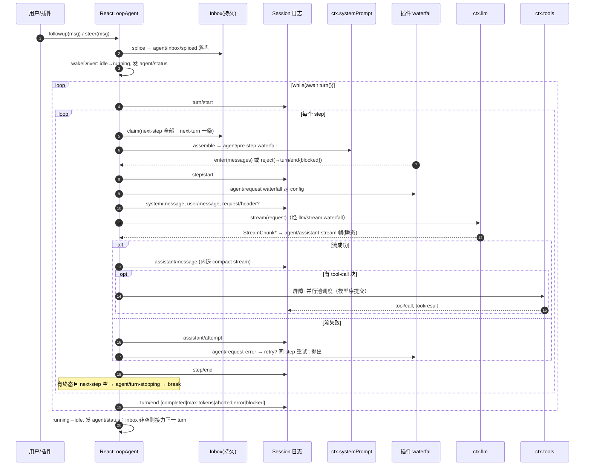

# Agent Loop 研究笔记

> 仓库：`/Users/bytedance/codes/open-source/deepseek-harness`
> 核心源码：`packages/core/agent-loop/src/agent.ts`（ReactLoopAgent，705 行，全篇值得精读）
> 配套文档：`docs/agent-lifecycle.zh.md`（官方时序图）、`docs/subsystems/core.zh.md`

## 一句话定位

`agent-loop` 包实现了一个**事件溯源的 ReAct 驱动器**：每个 Agent 挂在一个 append-only 的 Session 日志上，driver 按「认领 inbox → pre-step 拦截 → 组装请求 → 流式调模型 → 执行工具 → 追加结果回日志」的节拍循环，直到自然停止；日志是唯一事实源，内存状态随时可由日志重放重建（`docs/subsystems/core.zh.md:9`）。

## 关键文件地图

| 文件 | 职责 | 教学价值 |
|---|---|---|
| `packages/core/agent-loop/src/agent.ts` | `ReactLoopAgent`：相位机 + turn/step 双层循环 + 请求组装 + 流处理 + 错误兜底 | ⭐⭐⭐ 主教材，turn()/step() 两个方法读透即懂全局 |
| `packages/core/agent-loop/src/inbox.ts` | 双队列（next-turn / next-step）持久化收件箱，splice 即日志事件 | 理解 steer/排队的唯一入口 |
| `packages/core/agent-loop/src/tool-calls.ts` | 一步内工具调用的调度：独占屏障 + 有界并行池 + 模型序提交 | 并发控制的精巧小例子 |
| `packages/core/agent-loop/src/assistant-stream.ts` | 一次模型 attempt 的流帧发布 + 持久 compact stream 累积 | 「实时显示 vs 持久回放」双轨设计 |
| `packages/core/agent-loop/src/runtime-context.ts` | 系统提示词 / 运行时上下文投影（变化才提交日志） | 增量落盘思想 |
| `packages/core/agent-loop/src/index.ts` | `AgentLoop` 服务：注册 turnBoundary/inbox 投影、工厂创建 Agent | 生命周期装配（index.ts:57-95, 378-381, 604） |
| `packages/core/agent/src/types.ts` + `runtime-types.ts` | `Agent` 公开契约：send/followup/steer/inject/cancel、事件词汇 | 接口与实现分离的范本 |
| `packages/core/agent/src/dispatch.ts` | agent 作用域事件分发（emit/serial/waterfall 三态） | 插件拦截点的机制 |
| `packages/llm/llm/src/types.ts` | `ContentBlock` / `StreamChunk` / `FinishReason` 词汇定义 | 对话数据模型（types.ts:63-165, 452-462） |
| `packages/core/session/src/types.ts` | `SessionEventMap`、`TurnEndReasonMap`：持久事件词汇 | 事件溯源 schema（types.ts:201-232） |

## 核心机制详解

### 1. 相位机：idle / running / maintenance

Agent 没有显式「状态机类」，而是一个 `Phase` 可判别联合（agent.ts:41-49）：

```ts
type Phase =
  | { kind: 'idle'; lastTurn: number }
  | { kind: 'maintenance'; abort: AbortController; lastTurn: number; wakeRequested: boolean }
  | { kind: 'running'; abort: AbortController; turn: number; step: number; wakeRequested: boolean }
```

对外只有 `idle | running` 两种 `agent/status`（agent.ts:147-150；`maintenance` 对外也算 idle）。`wakeDriver()`（agent.ts:214-244）是唯一的驱动器入口：idle 时置 running 并启动 `kick()`；非 idle 时按条件**闩锁**（latch）`wakeRequested`，等当前活动收敛后重放（agent.ts:262）。

### 2. 一个 turn 的完整生命周期

`kick()` 是 driver 本体：`while (await this.turn()) {}`（agent.ts:254）——`turn()` 返回 `true` 表示 inbox 还有活，接着开下一 turn。`turn()` 内部（agent.ts:298-398）：

1. `turn = phase.turn + 1`，立即 `session.append('turn/start')`（agent.ts:305-307）——**turn 边界先于任何输入认领落盘**；
2. 进入 step 循环（agent.ts:315）：`preStep()` 认领输入并跑 `agent/pre-step` waterfall（agent.ts:267-288）；
3. `step/start` → `step()` 执行模型调用+工具 → `step/end`（agent.ts:331, 340, 358）；
4. 若已有终态且 next-step 队列为空：先发 `agent/turn-stopping` 串行检查点（插件可在此 steer 阻止结束，agent.ts:361-365），然后 break；
5. `finally` 中无条件 `turn/end` 落盘（agent.ts:387）；
6. `!inbox.hasPending` 则 driver 收工（return false），否则换新 AbortController 继续下一 turn（agent.ts:392-397）。

异常路径：signal aborted → `turn/end { kind: 'aborted', reason }`；其他错误 → `{ kind: 'error', error }`（agent.ts:368-383）。

### 3. turn 与 step 的边界由什么决定

**turn = 一次「驱动器被唤醒后直到自然停止」的完整活动**，可以包含多个 step；**step = 一次模型调用 + 该调用请求的全部工具执行**（session/src/types.ts:298-300 注释）。循环退出条件集中在 agent.ts:315-367 的 `while (true)`：

```ts
const decision = await this.preStep(target, { turn, step })
if (decision.kind === 'reject') { turnEnds = { kind: 'blocked' }; return false }   // :319
if (turnEnds && decision.messages.length === 0) break                             // :323 无新输入即停
...
if (turnEnds && this.inbox.nextStep.length === 0) break                           // :365 自然停止
target = 'next-step'                                                              // :366 后续 step 改认领 next-step
```

`step()` 的返回值决定 `turnEnds`：无 tool-call 块 → `'completed'`；`max-tokens` → 粘性终态（agent.ts:338-343：一旦触顶，后续 step 正常完成也不降级）；有工具 → 执行后返回 `null`（继续循环）或 `'completed'`（工具声明 `concludesTurn`，agent.ts:551-555）。

### 4. LLM 流式响应如何逐块处理

step() 内 `for await (const chunk of stream)`（agent.ts:457-460），每个 chunk 交给 `AssistantStreamAttempt.push()`（assistant-stream.ts:60-69）做三件事：

```ts
push(chunk: StreamChunk): void {
  const timed = this.accumulator.push({ time: Date.now(), chunk })  // 持久 compact stream
  this.assembler.push(timed.chunk)                                  // BlockAssembler 拼 block
  this.emit({ type: 'chunk', attemptId, revision: nextRevision(), index: this.index++, time, chunk })
}
```

第三行就是 UI 实时显示的 `agent/assistant-stream` 瞬态帧（agent.ts:449 注入 emit）。`StreamChunk` 是块级增量协议（llm/src/types.ts:452-462）：`block-start / text-delta / reasoning-delta / tool-call-delta / block-end / usage / finish`。`ContentBlock` 共 7 类（types.ts:138-146）：`text`、`reasoning`、`image`、`file`、`tool-call`、`tool-addition`、`tool-removal`（后两者属于 developer 消息，记录工具集动态增删）。

流结束后的结算（settle）严格**先落盘后通知**（assistant-stream.ts:78-97）：成功 → `assistant/message`（嵌入完整 compact stream，agent.ts:537-546）；失败/中止/重试 → `assistant/attempt`（只有 stream 没有消息，agent.ts:507-509）。

### 5. 工具调用发生在哪一环

工具执行发生在 **step 内、assistant/message 落盘之后**（agent.ts:549-554）：

```ts
const toolCalls = message.content.filter(block => block.type === 'tool-call')
if (toolCalls.length === 0) return { kind: 'completed' }
const { concluded } = await executeToolCalls(
  this.loopCtx, turn, step, toolCalls, signal,
  context => this.inbox.splice('next-step', this.inbox.nextStep.length, 0, [context]),
)
return concluded ? { kind: 'completed' } : null
```

`executeToolCalls`（tool-calls.ts:60-104）的流程：

- **派发前重新分类**：每个调用启动前查 `ctx.tools.executionMode()`（tool-calls.ts:89）——`exclusive` 构成屏障（独占执行），`parallel` 进有界滚动池（上限 `maxParallelToolCalls`，默认 10，constants.ts:6）；
- **模型序提交**：`Promise.race` 并发收割（tool-calls.ts:222），但 `commitReady()` 只按连续模型序提交结果（tool-calls.ts:147-161）——执行可乱序，结果落盘绝不乱序；
- **回填对话**：启动时 `tool/call` 落盘（tool-calls.ts:263-266），提交时 `tool/result` 携带 `sourceEventSeqs: [callSeq]` 回链调用事件（tool-calls.ts:269-288）；工具产生的附加上下文经回调塞进 next-step 队列，下一 step 认领；
- **中止兜底**：abort 时未启动的调用补一条合成错误结果（`tool call aborted before dispatch`，tool-calls.ts:250-261），保证回放时每个 tool-call 都有配对结果；step 抛错时 `ToolCallRecovery` 在 turn 层补记残留结果（agent.ts:333-355）。

### 6. inbox 机制与 steer / interrupt

inbox 是**持久化**双队列：`next-turn`（整轮提示）与 `next-step`（步间输入），每次变更都是一条 `agent/inbox/spliced` 日志事件 + 内存投影折叠（inbox.ts:31-62, 198-240），因此崩溃恢复后队列不丢。四个入口是 `send()` 的预设别名（agent.ts:154-173）：

| 方法 | target | wakeup | 语义 |
|---|---|---|---|
| `followup` | next-turn | 是 | 排队下一轮，唤醒 driver |
| `steer` | next-step | 是 | turn 进行中注入，下一个 step 边界生效 |
| `inject` | next-step | **否** | 只排队不唤醒，等下一次边界顺带认领 |
| `cancel` | — | — | 清空 inbox（除非 keepInbox）并 abort 当前 AbortController（agent.ts:175-181） |

认领规则（inbox.ts:109-114）：每个 step 边界拿走**全部** next-step 输入；turn 首个 step 额外拿走**一条** next-turn 消息。

**steer vs interrupt（cancel）**：steer 不中断任何进行中的模型调用/工具——消息进 next-step 队列，等当前 step 结束后被认领、走同一个 `agent/pre-step` waterfall 进入下一步请求；cancel 是直接 abort 相位自带的 AbortController，循环内密布 `signal.throwIfAborted()` 检查点（agent.ts:458 等），被中断的流以 `interruptedBlocks()` 保留已交付文本落盘（agent.ts:466-480），turn 以 `aborted` 终态关闭。特殊细节：abort 已生效时再 wakeup 的消息会被**重分类到 next-turn**（agent.ts:156-158），避免混入正在收尸的活动。

### 7. 循环退出条件与 stop reason

两层「停止原因」不要混淆：

- **FinishReason**（模型单次响应为何停，llm/src/types.ts:155-165）：`stop / tool-calls / max-tokens / aborted / error`；
- **TurnEndReason**（整个 turn 为何结束，session/src/types.ts:201-228）：`completed / aborted / blocked / error / max-tokens`，另有循环从不现场发出的 `interrupted`（崩溃后补记）与 `forked`（fork 种子关闭）。

映射关系：step 内 `finish.kind === 'max-tokens'` 直接返回（agent.ts:547）；`error/aborted` 先走 `agent/request-error` waterfall 给插件一次重试机会（agent.ts:511-526，重试不重复 pre-step 与用户消息准入），不重试则抛 `LlmError` 上冒为 turn 级 `error`；`blocked` 来自 pre-step 拒绝（agent.ts:319-321）；`abort` 来自 signal 检查点抛出。`max-tokens` 是**粘性**的：turn 内任何 step 触顶，turn 终态即 max-tokens，不被后续正常 step 覆盖（agent.ts:343）。

### 8. 上下文如何组装

每个 step/attempt 的请求由 `step()` + `prepareRequest()` + `buildRequest()` 三段拼装：

- **系统提示词**：`ctx.systemPrompt.assemble(assembleContextFor(this, signal))`（agent.ts:272；assembleContextFor 在 dispatch.ts:174，绑定 agent+scope）；`SystemPromptProjection.project()`（runtime-context.ts:88）做增量对账，只有变化才提交 `system/message` 事件（agent.ts:416-424）；
- **运行时上下文**：`RuntimeContextProjection` 投影成一条 `runtime-context` 来源的 UserMessage 注入（agent.ts:413, 430-439）；
- **请求配置**：`agent/request` waterfall 让插件改写 config（agent.ts:594），再 `llm.prepareCall()` 绑定适配器（agent.ts:603）；
- **工具定义**：`assembly.tools` 随 header 规范化，`request/header` 事件按 initial/resume/change/series 四种原因快照（agent.ts:637-651）；工具集变化额外落一条 developer 消息（agent.ts:655-669）；
- **消息历史**：**不从内存读**——`session.deriveMessages()` 从日志派生边界消息，深冻结后构造请求（agent.ts:688-701），`toolHistory` 同理。这就是「每个请求都从 session 日志派生」的含义（agent.ts:1-4 模块注释）。

### 9. 与 session 的交互：循环中落盘的事件

`Session.append()` 同步提交日志并通知 `session/event` 观察者（session/src/index.ts:876-899；持久化是插件职责，订阅该事件落盘）。一个正常带工具的 turn 落盘序列：

```
turn/start → (agent/inbox/spliced 认领) → step/start
  → system/message* → user/message* → request/header? → request/context?
  → assistant/message → tool/call → tool/result (+工具自有事件) → step/end
→ turn/end
```

瞬态不落盘的只有：`agent/status`、`agent/assistant-stream` 帧、`agent/inbox/*` 通知、`agent/pre-step|request|request-error|turn-stopping` 拦截点。`docs/agent-lifecycle.zh.md` 的 Mermaid 图是权威的逐事件时序。

## 端到端调用链：从用户按下回车到第一个 token 显示

以 Web/API 入口为例（括号内为文件:行号）：

1. 前端提交 prompt → Session Controller 命令层组装 `UserMessage`（`packages/api/session-controller/src/commands.ts:340-355`，附件准入、校验）
2. `agent.followup(message)` 或 steer 模式 `agent.steer(message)`（commands.ts:364-365）
3. `send()` → `inbox.splice('next-turn', …)` 持久入队 + `wakeDriver()`（agent.ts:154-161, 214）
4. 相位 idle → running，发 `agent/status: running`，启动 `kick()`（agent.ts:233-241）
5. `turn()` 落 `turn/start`（agent.ts:307）
6. `preStep()`：`inbox.claim` 认领消息（agent.ts:271）→ `systemPrompt.assemble`（agent.ts:272）→ `agent/pre-step` waterfall（agent.ts:274-284，插件可拒绝/改写）
7. `step/start` 落盘（agent.ts:331）
8. `step()`：`agent/request` waterfall 定 config（agent.ts:594）→ `prepareCall` 绑适配器（agent.ts:603）→ 系统提示/用户消息/请求头依次落盘（agent.ts:423-439, 637-651）→ `deriveMessages()` 冻结出请求（agent.ts:688-701）
9. `llm.stream(request)` 经 `llm/stream` waterfall 到适配器发起 HTTP SSE（agent.ts:453；`packages/llm/llm/src/index.ts:1143-1158`）
10. `live.start()` 发 start 帧 → 首个 `text-delta` chunk 到达 → `live.push(chunk)`（agent.ts:455-459）
11. → `dispatch.emit('agent/assistant-stream', { frame })`（agent.ts:449 → assistant-stream.ts:60-69）
12. → Client 侧转成瞬态 `assistant/live-chunk` 事件进入 Conversation 装配层渲染（`docs/subsystems/conversation.zh.md`，「实时 Assistant delta」节）

## turn 生命周期状态图（文字版 + Mermaid 草案）

文字版：

```
idle --followup/steer(wakeup)--> running: turn=N
  turn: turn/start
    loop steps:
      preStep(claim inbox) --reject--> turn/end{blocked} --> idle
      preStep --enter--> step/start --> step(): stream → assistant/message
        ├─ 无 tool-call ──> step/end ──(next-step 空 & turn-stopping 通过)──> turn/end{completed} --> idle
        ├─ 有 tool-call ──> executeToolCalls ──> step/end ──> 下一 step
        ├─ max-tokens ──> step/end ──> 下一 step 或 turn/end{max-tokens}
        ├─ 请求错误 ──> agent/request-error ──retry──> 同 step 重试
        │                                  └─否则──> turn/end{error} --> idle(抛错)
        └─ abort ──> turn/end{aborted} --> idle(抛错)
  turn 结束且 inbox 非空 --> 直接开 turn=N+1（同一 driver）
```

Mermaid 草案见文末。

## 设计权衡与常见坑

1. **日志即事实源，内存只是投影**。请求历史由 `session.deriveMessages()` 现算（agent.ts:688），不维护内存对话数组。好处：崩溃恢复、fork、compaction 天然一致；代价：每次请求重新派生，且所有要影响模型的内容必须先落盘——插件想注入内容必须走 pre-step/系统提示投影，不能偷偷改内存。
2. **「先落盘后通知」的结算顺序**。`AssistantStreamAttempt.settle()` 先 `session.append` 成功才发 end 帧（assistant-stream.ts:78-97）。若顺序反过来，UI 会显示一条崩溃后无法回放的消息。坑：settle 的 append 是同步的，任何校验失败都会让 attempt 转为 `abandon()` 并把原始错误一起抛出（AggregateError，agent.ts:494-501）。
3. **max-tokens 粘性 + turn-stopping 检查点**。终态一旦贴上就不能降级（agent.ts:343），而 `agent/turn-stopping` 给插件最后一次 steer 续命的机会（agent.ts:361-363）——监听器若在此 `agent.steer()` 会阻止 turn 结束，这是续跑的唯一正规渠道，在别处 steer 时机可能错过认领批次（inject 的文档注释 runtime-types.ts:234-241 明确警告了这点）。
4. **并发工具执行但模型序提交**。`Promise.race` 收割 + `commitReady` 只推进连续前缀（tool-calls.ts:147-161, 222），并且**每次启动前重新查 executionMode**（tool-calls.ts:204-205）——注册表在跑途中变了也安全。坑：独占工具会隐式形成屏障，把它和并行工具混排会拖慢整池。
5. **inbox 是持久化的，splice 即事件**。任何 replace/remove/clear 都落 `agent/inbox/spliced`（inbox.ts:235），重复消息 id 直接被 fold 拒绝（inbox.ts:44-51）——手工构造 UserMessage 时复用 id 会炸投影。
6. **abort 后 wakeup 的重分类**。取消信号已触发时再唤醒，消息被强制归入 next-turn（agent.ts:156-158），防止 steering 混入正在收尸的 turn；理解错这一点会写出「取消了但消息进了当前 turn」的幻觉 bug。

## 教学建议（入门向阅读顺序）

1. **先读文档**：`docs/subsystems/core.zh.md`（主干速览 + Agent 句柄）→ `docs/agent-lifecycle.zh.md`（对着 Mermaid 时序图建立全局印象）。
2. **读词汇**：`packages/llm/llm/src/types.ts` 的 ContentBlock/StreamChunk/FinishReason（63-165, 445-462 行）+ `packages/core/session/src/types.ts` 的 TurnEndReasonMap（201-232 行）。词汇懂了，代码就是词汇的排列。
3. **读契约**：`packages/core/agent/src/runtime-types.ts` 中 Agent 接口的 followup/steer/inject/cancel 注释（约 165-241 行）——注释即规格。
4. **读主循环**：`agent.ts` 按 Phase → wakeDriver/kick → turn() → step() 顺序精读；把 preStep/prepareRequest/buildRequest 当「请求组装三段式」单独看。
5. **读三个配套小件**：inbox.ts（持久队列）、tool-calls.ts（调度器）、assistant-stream.ts（双轨流）。每个都 <300 行。
6. **用测试验收理解**：`packages/core/agent-loop/tests/` 的 loop.spec.ts、inbox.spec.ts、cancel.spec.ts、tool-calls.spec.ts 覆盖了本文全部机制。

## 建议测验题

**Q1. 用户在一个 turn 进行中调用 `agent.steer(msg)`，消息何时进入模型上下文？**
A. 立即中断当前模型流并重新请求
B. 当前 step 结束后，在下一个 step 边界被认领，经 `agent/pre-step` waterfall 进入
C. 直接拼进当前请求的 messages 尾部
D. 等 turn 结束后作为新 turn 的第一条消息

答案：**B**。steer = `send(input, 'next-step', true)`（agent.ts:167-169），step 边界 `inbox.claim` 拿走全部 next-step（inbox.ts:109-114），且只在 step 之间生效——它不会打断进行中的流（循环内只有 abort 检查点，agent.ts:458）。D 是 followup 的语义。

**Q2. 某 turn 的第 2 个 step 因 max-tokens 结束，第 3 个 step 正常 completed，turn/end 的 reason 是？**
A. completed  B. max-tokens  C. error  D. aborted

答案：**B**。max-tokens 粘性规则：`if (turnEnds === null || turnEnds.kind !== 'max-tokens') turnEnds = stepEnd`（agent.ts:343），正常完成不能降级已触顶的 turn。

**Q3. 工具并发执行时，两条 `tool/result` 事件的落盘顺序由什么保证？**
A. 工具完成的先后顺序
B. `Promise.race` 返回顺序
C. 模型发出 tool-call 的顺序（模型序），由 commitReady 只推进连续前缀保证
D. 工具名字典序

答案：**C**。执行可乱序（tool-calls.ts:222 race），但提交循环 `while (committed < group.length)` 只消费连续已就绪槽位（tool-calls.ts:147-161），保证日志与模型调用顺序一致，回放才有效。

**Q4. 模型请求流中途失败（非 abort），driver 首先做什么？**
A. 直接 turn/end{error}
B. 落 `assistant/attempt` 事件，然后跑 `agent/request-error` waterfall 给插件重试机会
C. 自动指数退避重试三次
D. 丢弃本次 attempt 的所有 chunk

答案：**B**。finish 为 error/aborted 时先 `settle('assistant/attempt', …)` 把 compact stream 落盘（agent.ts:507-509），再发 waterfall（agent.ts:511-520）；仅当插件返回 `{kind:'retry'}` 才在同 step 内 continue 重试（agent.ts:523-526），重试不重复 pre-step 与用户消息准入。循环本身不带退避策略。

**Q5. 下列哪一项**不会**被持久化到 session 日志？**
A. `agent/inbox/spliced`（用户排队了一条 followup）
B. `agent/assistant-stream` 的 chunk 帧
C. `assistant/message`（内嵌 compact stream）
D. `request/header`

答案：**B**。`agent/*` 是实时协调接口，瞬态不落盘（docs/agent-lifecycle.zh.md：「实时 `agent/assistant-stream` chunk frame 是瞬态数据」）；回放读的是 `assistant/message` 或 `assistant/attempt` 内嵌的 compact stream。A/C/D 都是 `SessionEventMap` 成员（A 由模块合并声明于 agent/src/types.ts:96-107，C/D 在 session/src/types.ts 的 SessionEventMap 内）。

## Mermaid 图草案（turn 时序图）


