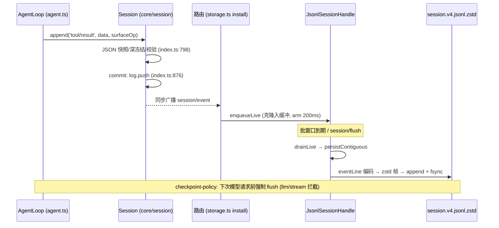
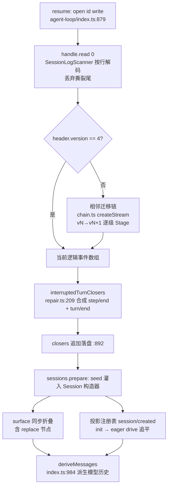

# Session 与记忆研究笔记

> 分析对象：DeepSeek Harness 仓库（`/Users/bytedance/codes/open-source/deepseek-harness`）。
> 所有引用均为 `仓库相对路径:行号`，已用 `rg` 逐一核实。

## 一句话定位

DSH 的会话是一个**事件溯源（event-sourced）系统**：内存里的 `Session` 只持有一条 append-only 的 `SessionEvent` 日志作为唯一真源，模型消息历史、UI 状态、标题、token 统计全部是从这条日志**投影（projection）**出来的；JSONL 后端把日志按批落盘到 `~/.dsh/sessions/`，重启后整段重放即可无损恢复现场。

## 关键文件地图

| 文件 | 角色 |
|---|---|
| `packages/core/session/src/types.ts` | 事件词汇表：`SessionEventMap`(:281)、`SessionEvent` 信封(:493)、`SessionHeader`(:94)、`SESSION_FORMAT_VERSION = 4`(:89) |
| `packages/core/session/src/index.ts` | `Session.append()`(:798) 同步提交 + `commit()`(:876) 发 `session/event`；`deriveMessages()`(:984) 由 surface 派生模型历史 |
| `packages/core/session/src/surface.ts` | 有序 surface：append/replace 两种 `SurfaceOp` 的校验与维护 |
| `packages/core/session/src/repair.ts` | `interruptedTurnClosers()`(:209)：为崩溃日志合成 step/turn 关闭事件 |
| `packages/core/agent-loop/src/agent.ts` | agent 主循环，写 `turn/*`、`step/*`、`user/message`、`assistant/*`、`request/header` 等事件(:307,:331,:387,:468,:637) |
| `packages/core/agent-loop/src/tool-calls.ts` | `tool/call`(:264) 与 `tool/result`(:282) 的追加点 |
| `packages/core/agent-loop/src/index.ts` | `create()`(:689)/`resume()`(:843)：经写句柄读日志、补关闭事件、prepare 再发布 |
| `packages/session/session-persistence/src/index.ts` | 抽象 seam：`SessionPersistence.create/open/list/flush`(:152,:167,:180,:203) 与 `SessionHandle.read/append/flush/close` |
| `packages/session/session-persistence-jsonl/src/format.ts` | 路径与行格式：`projectKey`(:225)、`sessionDir`(:267)、`logPath`(:298)、`eventLine`(:322)、`SessionLogScanner`(:386) |
| `packages/session/session-persistence-jsonl/src/storage.ts` | 活跃路由：`enqueueLive`(:274) + 200ms 批窗口(:36) + `drainLive`(:288) + `install(ctx)`(:534) 监听 `session/event|flush|disposed` |
| `packages/session/session-persistence-jsonl/src/index.ts` | 物理写：`persistBatch`(:863)、`appendLines` 追加+fsync(:1334)、首写 `materialize`(:1186，temp→fsync→link 发布) |
| `packages/session/session-format*/src/{chain,generated}.ts` | 格式链：`createSessionFormatChain`（chain.ts:42）与静态目录 generated.ts:16（codec + 四条相邻迁移） |
| `packages/session/session-format-v{0-to-1,1-to-2,2-to-3,3-to-4}/src/migration.ts` | 四条相邻迁移边 |
| `packages/session/session-projection/src/index.ts` | 投影注册表：单元契约(:43)、热驱动 `drive()`(:658)、冷恢复 `restore()`(:496) |
| `packages/session/session-checkpoint-policy/src/index.ts` | 语义检查点：模型请求/工具派发/pre-step 前 `ctx.sessions.flush`(:35,:72,:80) |
| `packages/compaction/compaction/src/types.ts` | 压缩事件词汇：`compaction/start|summary|end`(:24,:34,:72) |
| `packages/compaction/compaction-basic/src/index.ts` | 压力触发：挂 `agent/pre-step`(:158) 与 `agent/request-error`(:190)；阈值配置(:81-103) |
| `packages/compaction/compaction-basic/src/region.ts` | 压缩事务：start(:210)→summary(:491)+replace `user/message`(:507)→end(:237) |
| `packages/session/session-title/src/index.ts` | 标题服务 + `session/title` 事件(:77) 与标题投影(:274) |
| `packages/bundle/base/cordis.patch.yml` | 组合根：`root: dshHomePath('sessions')`(:136) |
| `packages/util/home-paths/src/index.ts` | `DSH_HOME_DIR_NAME = '.dsh'`(:12)、`DSH_HOME` 环境变量(:18) |

## 核心机制详解

### 1. 会话事件模型：一份可声明合并的日志词汇表

`SessionEventMap` 是一个**故意留空的、可被各包声明合并（declaration merging）扩展**的接口——core 只定义主干事件，compaction、title、goal 等子系统各自往里加键（`docs/subsystems/compaction.zh.md` 明确说“压缩通过声明合并为 SessionEventMap 扩展三种事件类型”）。core 自带的主干（types.ts:281-428）：

- 边界：`turn/start`(:288)、`turn/end`、`step/start`、`step/end`
- 消息面：`system/message`、`developer/message`、`user/message`(:307)、`assistant/message`(:339，内嵌精确 `stream` 与 `usage`)、`assistant/attempt`（未上 surface 的失败尝试）
- 工具：`tool/call`（原始未解析的 `arguments` 字符串）、`tool/result`(:375，含 `error`/`meta`)
- 请求快照：`request/header`、`request/context`
- 生命周期标记：`session/end-seed`(:427，fork/恢复切割点)

事件信封是判别联合（types.ts:493）：

```ts
export type SessionEvent<T extends SessionEventType = SessionEventType> = {
  [K in SessionEventType]: {
    type: K
    seq: SessionSeq          // 恒等于 log 下标，连续无洞
    time: number             // epoch 毫秒
    data: SessionEventMap[K]
    ignorable?: true         // 未知类型可安全跳过；缺省=必须能读懂否则拒绝
  } & (K extends SurfaceEventType ? SurfaceIntent<K>
     : { surfaceOp?: never; sourceEventSeqs?: never })  // 编译期隔离
}[T]
```

关键约束（types.ts:446-463）：只有五种“产消息”事件（`SurfaceEventType`）能携带 `surfaceOp`/`sourceEventSeqs`，其中 `SurfaceOp` 只有 `'append'` 或 `{ op: 'replace', startSeq, endSeq }`——**日志永远 append-only，但模型可见的 surface 允许被替换**，这是压缩的地基。

追加入口 `Session.append()`（index.ts:798）是**纯同步、热路径零 I/O**：

```ts
append<T extends SessionEventType>(type, data, ...opts) {
  const dataSnapshot = snapshotJsonValue(data)          // 拒绝非 JSON（BigInt/Date/环…）
  const entry = this.publicationEntry()                 // 防 append 重入
  const event = deepFreeze({ type, seq: SessionSeq(this.log.length),
                             time: Date.now(), data: dataSnapshot, ... })
  validateSessionEventData(event, ...)                  // surface 契约等一致性规则
  this.commit(event, entry)                             // 入 log + 通知 session/event
  return event
}
```

`commit()`（index.ts:876）先经 `surfaceManager.validateNext` 校验，再 `log.push`，最后向 store 收集到的 `session/event` 监听器**同步广播**（观察者异常被逐 listener 收容，不影响提交）。

### 2. jsonl 落盘格式：头行 + 一事件一行，按项目分目录

**路径解析**（format.ts）：root（默认 `~/.dsh/sessions`，由 `cordis.patch.yml:136` 的 `dshHomePath('sessions')` 注入，`home-paths/index.ts:12` 定义 `.dsh`）之下：

```
<root>/<projectKey>/<encodeSegment(sessionId)>/session.v4.jsonl[.zstd]
```

- `projectKey(cwd)`(:225)：把项目路径的 `/`、`\`、`:` 折叠成 `-`，危险字符转义成 `~XXXX`，包成 `--slug--`，例如 `--Users-bytedance-codes-open-source-daimon--`；无 cwd 时用 `_no-cwd`(:254)
- `encodeSegment(id)`(:199)：SessionId 是未校验字符串，必须单射转义（防 `../` 穿越）
- 文件名：`session.v4.jsonl`（v0 不带后缀，其后各代带 `vN`），默认再经 zstd 帧压缩 → `session.v4.jsonl.zstd`（`logSuffix`/`generationLogFilename`，format.ts:40-64）

**行结构**：第 1 行是物理 header（`toHeaderLine`，format.ts:119），之后每个事件一行 JSON（`eventLine`(:322) → `sessionFormatCatalog.encodeCurrentEvent`）。真实样例（本机 `~/.dsh` 下一条 `tool/result`，内容已脱敏截断）：

```json
{"type":"tool/result","seq":21,"time":1791539945183,
 "data":{"turn":1,"step":1,
   "message":{"role":"tool","toolCallId":"call_00_xxx","content":[{"type":"text","text":"DSH_HOME=/path/to/dsh-home\n..."}],"isError":false,"id":"92321b89-..."}},
 "sourceEventSeqs":[20],"surfaceOp":"append"}
```

逐字段：`type` 判别键；`seq` 日志序号（=行号-2）；`time` 追加时刻；`data.turn/step` 归属坐标；`data.message` 是模型可见的 `ToolResultMessage`（`toolCallId` 与 `tool/call` 配对）；`sourceEventSeqs:[20]` 声明它派生自 seq 20 的那条 `tool/call`；`surfaceOp:"append"` 声明它追加进 surface 尾部。注意 v4 物理存储对 `sourceEventSeqs` 有区间压缩（连续 ≥3 个 seq 写成 `[start,end]`，README.zh.md:108）。header 行形如：

```json
{"type":"session","version":4,"id":"session-8ff37bf0-...","createdAt":1790853434302,
 "cwd":"/Users/.../default-workspace","isSeeded":false,"delegationDepth":0,"agentPreset":"standard"}
```

读取侧 `SessionLogScanner`（format.ts:386）在原始 Buffer 上按 `\n` 切分：只解码完整记录，尾部残缺碎片视为**撕裂尾（torn tail）**——崩溃时最后一批 append 没写完，属正常情况，不当作损坏。

**写入路径**（index.ts/storage.ts）：活跃事件先 `structuredClone` 进缓冲，`LIVE_WRITE_BATCH_MAX_DELAY_MS = 200`（storage.ts:36）的批窗口到期后 `drainLive`(:288) → `persistContiguous`(:319)（先补撕裂尾修复，再写本批）→ `persistBatch`(:863) → `appendLines`(:1334)：`open(path,'a')` + `writeFile` + `handle.sync()`（fsync），写失败回滚到原长度防 seq 重复。首写走 `materialize`(:1186)：临时文件 fsync 后用 **link()+unlink() 而非 rename()** 发布——link 遇到已存在目标会失败，rename 会静默覆盖（index.ts:1220 注释）。

### 3. 会话恢复：重放 = 种子 + 同步折叠

**日志级重放**发生在 `AgentLoop.resumeWith`（agent-loop/index.ts:853-915）：

```ts
handle = await persistence.open(id, 'write', ...)      // :879 先抢写所有权
const coldRead = await handle.read(0, undefined, ...)  // :888 全量读有效连续前缀
const closers = interruptedTurnClosers(persisted)      // :891 语义修复（repair.ts:209）
if (closers.length > 0) await handle.append(closers)   // :892 合成的 step/end+turn/end 落盘
preparation = SessionPreparation.create(this.ctx.sessions.prepare(id, {
  seed: [...persisted, ...closers],                    // 重放=把整段日志当构造种子
  meta: structuredClone(handle.header),
  inheritedEventCount: handle.inheritedEventCount,
  eventState: coldRead.eventState,                     // 'shared-frozen'，免二次深冻结
}))
```

即：jsonl →（必要时先跑格式迁移链，见下节）→ 当前逻辑事件数组 → 作为 `seed` 灌进 `Session` 构造器（构造器用与 `append` 相同的不变量校验种子，index.ts:637）→ surface 折叠在构造里同步重算，**“恢复”本质就是把磁盘日志再 append 一遍**。

**投影级重放**（session-projection/index.ts）：`SessionProjectionRegistry`(:199) 挂 `session/created`(:211) 与 `session/event`(:221)。每个投影单元是三元组（:43-88）：`init(header)` 造空态、`apply(state, event)` 纯折叠（**不关心的事件必须返回同一引用**，`Object.is` 相等即零下游开销）、`stateVersion` 决定持久化缓存行是否作废。两条路径：

- 热驱动 `drive()`(:658)：每提交一个事件，所有单元 eager 前进一步；视图变了才通知订阅者
- 冷恢复 `restore()`(:496)：不建活跃 Session 时，用检查点行 `(ver, seq, val)` 做种子 + 从 `baseSeq` 起前向重放尾巴；行过期且 `baseSeq>0` 直接抛错要求从 seq 0 重读（:513-519）

投影铁律写在模块头（index.ts:11-12）：**携带状态的事件必须携带变更后的完整值，不能是裸 delta**——这让每次转移都是 O(1) 且每个值自解释。

### 4. 格式版本 v0→v4：不可变历史代际 + 相邻迁移链

当前写入器 `SESSION_FORMAT_VERSION = 4`（types.ts:89；发布记录见 `docs/session-format-status.zh.md`，latestReleasedVersion 4 / 证据 tag `dsh-v0.2.0-rc.2`）。历史代际**永不重写**：磁盘上旧文件原样保留，读时才迁移。各代要点（`docs/persistence-changes/historical-formats/v*.zh.md` 的“格式特征”节）：

| 迁移 | 包 | 干了什么 |
|---|---|---|
| v0→v1 | session-format-v0-to-v1/src/migration.ts:26 | 近似恒等边：物理布局不变（仍打包 chunk 行），仅把 header 版本提升为 1，并做源端键审计（`LEGACY_ASSISTANT_SOURCE_KEY` 改名） |
| v1→v2 | session-format-v1-to-v2/src/migration.ts | 消灭顶层 `assistant/chunk`：把流式 chunk 折进 `assistant/message.data.stream`，新增 `assistant/attempt`；seq 重映射 |
| v2→v3 | session-format-v2-to-v3/src/migration.ts:14 | 系统提示词从 `request/header` 提升为一等 `system/message` 事件；信封规范化；`agentPreset: 'code'→'ptc'` 改名 |
| v3→v4 | session-format-v3-to-v4/src/migration.ts:16 | 工具结果角色、消息 source 重写、V3 不透明扩展事件收编进 `plugin:` 命名空间；**正文恢复要求显式提供历史子会话证据**（`createStage` 无证据即抛，migration.ts:27-29） |

链式装配是**生成代码**（session-format-catalog/src/generated.ts:16-47）：五个 codec + 四条相邻迁移静态 import，`createSessionFormatCatalog` 产出目录。链编译器（session-format/src/chain.ts）：

- 构造时校验“从 0 到 currentVersion 每个整数恰好一条相邻边”（chain.ts:66-72），缺边即 `SessionFormatUnsupportedMigrationError`
- `plan(from)`(:79) 切片出 `migrations.slice(from)`；`createStream`(:89) 把每步 `createStage` 串成流水线——已解码的历史行流经有状态 Stage，边解码边转换边校验，不必把全量历史物化两次
- 读取历史日志时，jsonl 后端只读 open 单遍解码+迁移后直接返回逻辑值（源文件逐字节不动）；写 open 才把迁移结果作为**新的当前代际文件**同目录发布（README.zh.md:84）

版本拒绝时机：`refuseForeignFormatVersion`（format.ts:344）在**校验 header 形状之前**拒绝更高版本——“请升级 harness”绝不被报成“日志损坏”。

### 5. 上下文压缩：surface 替换，而不是日志改写

压缩是可选能力 seam（`ctx.compaction`，`docs/subsystems/compaction.zh.md`），不属于 agent loop 主干。三个事件只进日志不进 surface（compaction/src/types.ts:24-72）：

| 事件 | 载荷要点 | 作用 |
|---|---|---|
| `compaction/start`(:24) | `{ compactionId, turn }` | 拿锁（`turn` 为数字=自动轮内，`null`=手动独立尝试） |
| `compaction/summary`(:34) | `{ summary, shadowedRange, shadowedSeqs, shadowedTokenCount, provider, model, usage?… }` | 可审计的摘要事实：遮蔽了哪些 seq、省了多少 token、哪个模型生成的 |
| `compaction/end`(:72) | `{ compactionId, turn, error? }` | 放锁；带 `error` 记录失败尝试 |

唯一动 surface 的是一条 `surfaceOp: { op:'replace' }` 的 `user/message`（region.ts:507）：

```ts
session.append('user/message', checkpointMessage, {
  surfaceOp: { op: 'replace', startSeq: start, endSeq: end },
  sourceEventSeqs: [startEvent.seq, summaryEvent.seq, ...shadowedSeqs],
})
```

事务骨架（region.ts:210-245）：`start` → 生成摘要 → `summary` + replace（同一同步段内提交）→ `end`；中途崩溃留下的是“有 start 无 end 的悬空锁”，可检测，而不是一个谎称成功的 end。

**触发**（compaction-basic/src/index.ts）：
- `agent/pre-step` waterfall(:158)：每步开跑前以 `'pressure'` 触发——按路由模型的 `thresholdRatio`（配置 :81-103）比较 `ctx.tokenMeter` 的压力测量；可选先跑 `toolResultPruner` 剪超长工具结果再复测
- `agent/request-error`(:190)：provider 确认上下文溢出后以 `'context-overflow'` 触发，可绕过常规阈值强制收缩
- 手动：`compactNow`（空闲会话，无有效范围返回 `null` 不写字）与 `compactRegion(start,end)`（显式 span），边界必须保持 tool call/result 配对（`toolPairingBalancedBefore/After`）

重放语义：被遮蔽的旧事件仍在日志里（审计、`shadowedSeqs` 可溯源），`deriveMessages()` 只走当前 surface 节点，摘要节点通过 `sourceEventSeqs` 指回全部遮蔽节点——**压缩对模型是替换，对存储是纯追加**。

### 6. append 与 agent loop：谁在何时写

主循环 `agent.ts` 的写入时序：

1. 领取轮次：`turn/start`(:307)
2. 每步：`step/start`(:331) → 注入/排队的 `user/message`(:430,:434,:439)、`system/message`(:423)
3. 派发请求前：`request/header`(:637) + `request/context`(:682)（先落请求快照，模型调用可被日志+代码重建）
4. 模型回复：`assistant/message`(:468，中断时 `interrupted:true`)，失败尝试记 `assistant/attempt`(:486)
5. 工具：`tool/call`（tool-calls.ts:264）→ 执行 → `tool/result`（tool-calls.ts:282，`sourceEventSeqs:[callSeq]`）；步内崩溃时由 `ToolCallRecovery` 补记已完成工具的结果（agent.ts:347）
6. `step/end`(:358，finally 里保证)；轮末 `turn/end`(:387，携带 `TurnEndReason`）

事件到磁盘的三条异步通路（都经由 storage.ts:534 `install(ctx)` 装的路由）：
- `session/event` → `enqueueLive`(:536)：200ms 批窗口，不阻塞生产方
- `session/flush` → `drainLive + flush`(:540)：耐久屏障；`session-checkpoint-policy` 在**每次模型请求前**(:35)、**顶层工具派发前**(:72)、**pre-step**(:80) 主动 flush——语义是“请求前缀未落盘，适配器不得派发”
- `session/disposed` → `close()`(:548)：最终排空后释放写租约

### 7. 多会话管理与标题（简述）

- 列表：`SessionPersistence.list()`（session-persistence/src/index.ts:203）只读各会话最高代际的 header（不解码事件行），供会话选择器展示；`session-query` 提供只读冷缓存（按 `stat().revision` 失效）
- 标题：`dsh-session-title`（session-title/src/index.ts）把标题也做成日志事件 `session/title`(:77) + 标题投影(:274)；provider 可换——`session-title-llm`（共享 LLM 执行策略：路由、token/时间上限）与 `session-title-first-prompt-llm`（用首条人类消息起标题）是两个出厂实现，无模型时 `fallbackSessionTitle` 走确定性兜底
- 并发所有权：写句柄 = 跨进程文件租约（lease.ts）+ 进程内单写者表；第二个 `open(id,'write')` 得 `SessionAlreadyOwnedError`（persistence.zh.md 的“准备与恢复所有权”节）

## 端到端调用链：一次工具结果的一生

以“模型调用 bash 工具 → 结果落盘 → 重启后恢复”为例：

1. **产生**：agent loop 执行工具完毕，`appendToolResult` 组好 `ToolResultMessage` → `session.append('tool/result', …, { surfaceOp:'append', sourceEventSeqs:[callSeq] })`（tool-calls.ts:282-296）
2. **校验+提交**：`Session.append` 快照 JSON、深冻结、校验（core/session/src/index.ts:798-826）→ `commit()` 入 `log`（:876-897）
3. **广播**：`invokeContainedSessionObservers` 同步发 `session/event`（:889）
4. **路由**：jsonl 后端的监听器按 `session.id` 找到写句柄 → `enqueueLive` 克隆入缓冲、arm 200ms 定时器（storage.ts:535-539 → :274-281）
5. **批量落盘**：窗口到期 → `drainLive`(:288) → `persistContiguous`(:319) → `persistBatch`（jsonl/index.ts:863）→ `appendLines`(:1334)：`eventLine` 编码（format.ts:322）→ zstd 帧（jsonl/index.ts:1312）→ `open('a')` 追加 + `fsync`（:1348-1349）
6. **语义检查点**：下一次模型请求前，`session-checkpoint-policy` 的 `llm/stream` 拦截先 `ctx.sessions.flush(session)`（checkpoint-policy/src/index.ts:35），保证“模型看到的上下文必然已 durable”
7. **崩溃/退出**：`session/disposed` → 最终排空 + 关句柄（storage.ts:548-555）
8. **重启 resume**：`AgentLoop.resume` → `persistence.open(id,'write')` 抢租约（agent-loop/index.ts:879）→ `handle.read(0)` 全量扫描（:888；`SessionLogScanner` 按行解码，丢弃撕裂尾，format.ts:386）→ `interruptedTurnClosers` 补 `step/end`+`turn/end{interrupted}`（:891；repair.ts:209）→ 若有则追加落盘（:892）
9. **重放成内存态**：整段事件作为 `seed` 进 `sessions.prepare`（:894-899）→ `Session` 构造器折叠 surface → 投影注册表经 `session/created`/`session/event` 把标题、token 等单元 eager 追上（session-projection/index.ts:211,:658）
10. **派生历史**：下一步请求时 `deriveMessages()`（core/session/src/index.ts:984）从当前 surface 节点（压缩后含 replace 摘要节点）投影出 `Message[]`，模型看到的就是压缩后的连续对话

## 设计权衡与常见坑

1. **为什么 append-only**：日志是唯一真源，任何状态都能重放重建；工具结果、中断痕迹、压缩审计（`shadowedSeqs`）全部可回溯。代价是读放大——于是有了 surface 的 `replace`（只改“模型可见面”，不改日志）和投影检查点缓存。坑：以为“压缩删了历史”——没删，`deriveMessages` 只是不读被遮蔽节点。
2. **为什么要版本迁移链而不是一次性转换**：已发布格式的用户数据不可丢弃（session-format-status.zh.md：“GitHub 的 prerelease 标记不会让持久化用户数据成为可丢弃数据”）。相邻迁移（只允许 vN→vN+1，chain.ts:35）让每条边只需理解两版差异，O(版本数) 条边覆盖 O(版本数²) 的组合；历史文件**逐字节保留**，迁移产物发布为新一代文件，出错可回退。坑：同版本内的语义演进也要兼容——“v4 内部的新事件”不能假设所有 v4 写入器都会写。
3. **为什么 append 同步、落盘异步 + 显式 flush 检查点**：模型流式热路径不能被 I/O 阻塞，所以 `append` 零 I/O、200ms write-behind；但“请求前缀”必须在模型调用/工具副作用发生**之前** durable，否则崩溃后日志会声称模型看到了它从没见过的上下文。这就是 `session-checkpoint-policy` 存在的理由；坑：自己写消费方时，`append` 返回 ≠ 已持久化，只有 `flush()` resolve 才承诺 crash-safe（SessionHandle 契约，persistence.zh.md）。
4. **崩溃恢复分两层**：物理层（撕裂的 zstd 帧尾部）由存储在下次写前截断+重写（storage.ts:319-329）；语义层（开着没关的 turn）由 agent 层合成 `interruptedTurnClosers` 补齐——**持久化不截断被中断的轮次**，因为长任务的一个轮次可能价值巨大。坑：`interrupted` 是唯一不由 loop 发出的 `TurnEndReason`，消费方做统计时别把它当成 loop 正常关闭。
5. **未知事件的 `ignorable` 默认拒绝**（types.ts:505-515 注释）：遇到不认识的必需事件宁可拒绝恢复也不静默丢弃——“过度拒绝是麻烦，静默恢复被掏空的会话是事故”。
6. **路径安全**：SessionId 是任意外部字符串，直接拼路径就是目录穿越漏洞，所以 `encodeSegment` 单射转义（format.ts:196 注释）；`projectKey` 则是有意有损的“人类可导航”命名，不要拿它反推 cwd。

## 教学建议（入门向）

1. **先建立心智模型**：一句话——“git 之于源码 = Session 日志之于对话”。append-only 事件流 + 重放 = 状态。把 `SessionEventMap`（types.ts:281）通读一遍，这是最浓缩的词汇表。
2. **动手实验路径**：`compression: 'none'` 起一个会话，直接 `cat session.v4.jsonl` 逐行对照 UI；再 `kill -9` 进程，重开观察撕裂尾修复和 `interrupted` 关闭事件的补写。
3. **阅读顺序**：types.ts（词汇）→ core/session/index.ts 的 `append/commit`（写路径）→ storage.ts 的 `enqueueLive/drainLive`（异步落盘）→ agent-loop/index.ts 的 `resumeWith`（读路径）→ session-format 的 chain.ts（版本链）→ compaction region.ts（replace 语义）。每步都配有 zh 文档：`docs/subsystems/persistence.zh.md` 是最佳总览。
4. **写一个最小投影**：实现一个 `ProjectionDefinition`（比如统计 user 消息数），体会 `init/apply/stateVersion` 与“返回同一引用=无变化”的约定——这是理解整个读侧最快的方式。
5. **调试入口**：`SessionLocation`（拒绝诊断里带原始日志绝对路径）+ `docs/persistence-catalog.zh.md`（全部事件字段目录）足以回答“这个事件是谁写的、字段什么意思”。

## 建议测验题

**Q1.** `Session.append()` 返回时，事件已经持久化到磁盘了吗？
A. 是，append 会同步写文件  B. 是，但仅在 compression:'none' 时  C. 否，append 只进内存日志并同步广播 `session/event`，持久化由 200ms 批窗口或 `flush()` 完成  D. 否，事件只在 `turn/end` 时落盘
**答案 C**。热路径零 I/O（index.ts:763-766 注释）；只有 `flush()` resolve 才承诺 crash-safe（persistence.zh.md 的 SessionHandle 契约）。

**Q2.** 压缩（compaction）后，被摘要遮蔽的原始事件去哪了？
A. 从 jsonl 中物理删除  B. 标记为 deleted 但保留  C. 原样保留在日志里，只是 surface 上用一条 replace 的 `user/message` 摘要节点替换它们的位置  D. 移动到单独的归档文件
**答案 C**。日志 append-only；唯一 surface 变更是 region.ts:507 的 `surfaceOp:{op:'replace'}`，`compaction/summary.shadowedSeqs` 记录被遮蔽 seq 供审计。

**Q3.** 一个 v1 格式的会话在当前（v4）构建上被写 open 时，会发生什么？
A. 拒绝，必须先用离线工具升级  B. 依次跑 v1→v2→v3→v4 三条相邻迁移，把当前代际文件发布到同目录，源文件保持逐字节不变  C. 原地改写为 v4  D. 只迁移 header，事件按需懒迁移
**答案 B**。相邻链 `migrations.slice(from)`（chain.ts:79-87）；“历史 open …源路径、字节与 inode 不变；写 open …发布当前后继”（persistence.zh.md“格式拒绝”节）。

**Q4.** 进程在 turn 中途崩溃，jsonl 最后一条 zstd 帧写了一半。resume 时哪两项修复会发生？
A. 整个会话作废重建  B. 物理层截断撕裂尾并重写其中完整事件；语义层由 `interruptedTurnClosers` 合成缺失的工具错误、`step/end` 和 `turn/end{kind:'interrupted'}` 追加落盘  C. 只丢弃最后一个事件  D. 回滚到上一个 `turn/start`
**答案 B**。撕裂尾修复在首次新 append 前（storage.ts:319-329）；语义修复是 agent 层职责（agent-loop/index.ts:891-892；repair.ts:209）。

**Q5.** 为什么 `SessionEventMap` 之外的未知事件类型默认会导致恢复**被拒绝**，而不是被跳过？
A. 性能原因  B. 因为未识别的必需事件可能改变后续日志的解释方式，静默丢弃会“恢复出一个被掏空的会话”；只有显式标 `ignorable: true` 的纯信息记录可跳过  C. 因为 TypeScript 类型不允许  D. 因为 zstd 解码失败
**答案 B**。types.ts:505-515 的契约注释：“defaulting to required means a forgotten marker over-refuses … rather than silently resuming a gutted session”。注意历史 v0/v1/v2 迁移连 ignorable 未知类型也拒绝（persistence.zh.md）。

## Mermaid 图草案

### 事件流（写入路径）



### 重放过程（resume）


