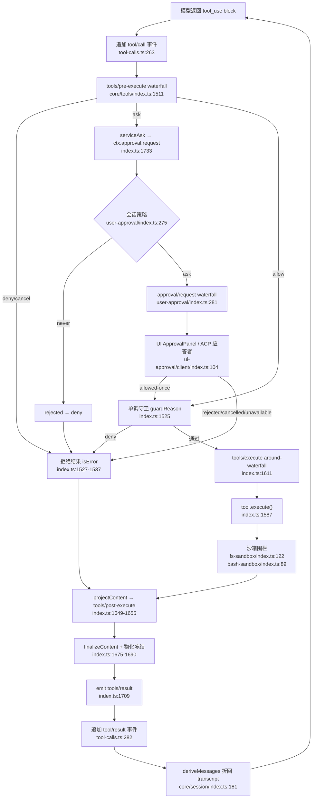

# 工具系统与权限研究笔记

> 仓库：`/Users/bytedance/codes/open-source/deepseek-harness`（monorepo，Cordis 插件框架 + 事件溯源 Session 日志）
> 方法：以 `rg` 实地读源码验证，所有论断附 `路径:行号`。

## 一句话定位

DeepSeek Harness 的工具系统是一个**以注册表（`ctx.tools`）为中心、以三段 waterfall（pre-execute / execute / post-execute）为扩展点、以「失败即拒绝（fail-closed）」为默认姿态**的执行管线：工具只是「schema + 纯函数执行体 + 纯投影渲染器」的组合，权限、审批、沙箱、截断全部作为**管线上可插拔的阶段**存在，而非工具自身的职责。

## 关键文件地图

| 文件 | 角色 |
| --- | --- |
| `packages/core/tools/src/schema.ts:554` | `defineTool()`：一等工具的工厂，编译参数 schema 并包校验 |
| `packages/core/tools/src/index.ts:808` | `ToolRuntime`：注册表 + 管线调度器（1991 行核心） |
| `packages/core/tools/src/index.ts:147-200` | 四个工具事件的类型声明（3 个 waterfall + 1 个 emit） |
| `packages/core/agent-loop/src/tool-calls.ts:60` | `executeToolCalls()`：模型 tool_use block 的入口 |
| `packages/core/system-prompt/src/index.ts:541` | `systemPrompt.tools()`：工具 schema 进系统提示组装的口子 |
| `packages/fs/tool-fs/src/read.ts:77` | `read` 工具完整定义（精读样例一） |
| `packages/shell/tool-bash/src/index.ts:367` | `bash` 工具完整定义（精读样例二） |
| `packages/interaction/user-approval/src/index.ts:150` | `ApprovalService`：`ctx.approval` 审批 seam |
| `packages/interaction/permission-presets/src/index.ts` | 权限预设（sandbox 模式 × 审批策略的捆绑） |
| `packages/fs/fs-sandbox/src/index.ts:55` | `SandboxedFileSystem`：文件沙箱围栏的强制点 |
| `packages/shell/bash-sandbox/src/index.ts:46` | `SandboxBashExecutor`：bash 的内核级隔离执行器 |
| `packages/sandbox/sandbox/src/escalation.ts:28` | 沙箱提级词汇表与 `approveEscalation` 编排 |
| `packages/compaction/compaction-tool-result-pruner/src/index.ts:44` | `ToolResultPruner`：历史工具结果的中段剪枝 |
| `docs/tool-execution-pipeline.zh.md` | 官方管线 Mermaid 图（本文 §端到端 的权威对照） |
| `docs/tool-catalog.zh.md:22-53` | 生成式工具目录（完整工具包映射表） |

## 核心机制详解

### 1. 工具如何定义：一个工具的完整解剖（以 `read` 为例）

工具 = **name + description + parameters（输入 schema）+ output（输出 schema + 渲染器）+ execute（执行体）+ 可选的 UI 呈现器**，全部由 `defineTool()` 收编：

```ts
// packages/fs/tool-fs/src/read.ts:77-84
ctx.tools.register(defineTool({
  name: 'read',
  description: 'Read a UTF-8 text file and return line-numbered content.',
  parameters: {
    file_path: { type: 'string', required: true, description: '...' },
    offset: { type: 'number', description: '1-based first line to return. Defaults to 1.' },
    limit: { type: 'number', description: `Maximum number of lines to return. Defaults to ${caps.limit}.` },
  },
```

三层校验递进：

1. **schema 校验**（声明式）：`defineTool` 把 `parameters` 编译成 JSON Schema，并在 `execute` 外包一层校验——违规抛 `ToolArgsError`（`packages/core/tools/src/schema.ts:597-600`，错误类在 `:461-469`）。
2. **值约束校验**（命令式）：schema DSL 表达不了的（如 `limit ≤ 配置上限`）在执行体内再查（`read.ts:55-61` 的 `parseReadArgs`；bash 侧对应 `tool-bash/src/index.ts:73-88` 的 `validateBashArgs`）。
3. **输出校验**：`output.schema` 强制每个成功值符合声明（`schema.ts:491-498`），`render(args, value)` 是纯函数投影，把规范值变成模型可读的 `ContentBlock[]`（`read.ts:107-120`）。

执行体拿到的 `exec: ToolRunContext` 含取消信号、agent 身份、callId（`packages/core/tools/src/index.ts:419` 起）。`execute` 必须返回**可无损 JSON 化的规范值**，而非文本——文本化是 `render` 的事（`index.ts:224-237`）。另有两个工具自有的内容回调：`projectContent`（执行后策略前安装内容，`:238-245`）与 `finalizeContent`（最后一公里、每次必跑、不许抛异常，`:246-258`），以及纯函数的 UI 呈现器 `presentCall`/`presentResult`（回放安全，`read.ts:173-208`）。

### 2. 工具如何注册并对模型可见

注册是一行 `ctx.tools.register(definition)`，返回 disposer（`index.ts:1069`）；重名即抛（`index.ts:747-749`）。对模型可见的链路是：

```ts
// packages/core/tools/src/index.ts:855 —— 构造时把 schema 提供器接进系统提示组装
ctx.systemPrompt.tools(context => this.wireSchemas(context.scope))
```

- `schemas(scope)` 把可见定义投影成**白名单四字段** `{name, description, parameters, deferLoading}`（`index.ts:1266-1268`、`:1288-1300`）；`timeoutMs`、执行体、呈现器**永不进 LLM 请求**（注释明写于 `index.ts:262-263`）。
- 作用域视图：`ToolLayer.admits()` 按 agent 作用域折叠 allow/deny 限制（`index.ts:759-765`），子代理可以只看见工具子集。
- 组装时 `system-prompt/src/index.ts:638-670` 收集各提供器 schema、按 `toolOrder` 排序；agent loop 在 `packages/core/agent-loop/src/agent.ts:272` 调 `assemble()`，在 `:442` → `:629` 把 `assembly.tools` 写进 LLM 请求。
- PTC 模式下整个目录坍缩成唯一工具 `run_code`（`index.ts:1030-1034`），其余工具经生成的 SDK 在代码里调用。

### 3. 工具执行管线：校验 → 审批 → 守卫 → 执行 → 后处理

注册表内部是三段式调度（`prepare → dispatch → finalize/finish`），主干在 `prepareExecution`：

```ts
// packages/core/tools/src/index.ts:1511-1525（节选）
const gate = await this.ctx.waterfall(
  carrier, 'tools/pre-execute', exec,
  () => Promise.resolve<PreToolDecision>({ kind: 'allow' }),
)
const askResolution = gate.kind === 'ask'
  ? await this.serviceAsk(exec, gate)
  : { decision: gate, approvalCancelled: false }
// ...
const denialReason = decision.kind === 'allow' ? this.guardReason(exec) : decision.reason
```

按序：

1. **`tools/pre-execute` waterfall**（`:1511-1514`）：钩子与策略产出 `PreToolDecision = allow | deny | cancel | ask`（`:608-612`）。故意**不支持改写参数**——"arguments are already logged and presented"（`:605`）。
2. **`ask` 解析**（`:1515-1517` → `serviceAsk` `:1733-1774`）：见 §4。
3. **单调守卫**（`:1525`，实现 `:1150-1160`）：`ToolGuard` 只能返回拒绝理由或弃权，**没有 allow 返回值**——"listener ordering cannot turn a denial back into permission"（`:725-732`）。这是后置的、不可被推翻的否决层。
4. **`tools/execute` around-waterfall**（`:1611-1614`）：超时/重试/指标包装 `dispatchToolBody`，后者在 `:1587` 真正调 `tool.execute()`。
5. **`projectContent` → `tools/post-execute` waterfall**（`:1649-1655`，post 实现在 `:1787-1790`）：策略可 accept（可替换 content/value）、block（把反馈变成 isError）、附 `additionalContexts`（`:618-621`）。
6. **物化与冻结**：`finishScheduledExecution`（`:1675-1690`）做无损快照、`finalizeContent`，然后 `notifyResult` 先 `Object.freeze(exec)` 再以 emit 模式广播 `tools/result`（`:1701-1720`）——观察者只能看，不能改。

任何一环抛异常都被规范化为 `isError` 结果而非炸掉循环（`:1542-1543`、`:1634-1635`）。

### 4. 审批机制：waterfall 语义、UI 介入、策略判定

**为什么用 waterfall？** Cordis 的 `ctx.waterfall` 是环绕中间件：监听器收到 `(...args, next)`，调 `next()` 委托下游并可包装其返回值，不调则短路（`docs/cordis-primer.zh.md:31-35`）。审批天然是「**第一个负责的人拍板，其他人让路**」的语义——`approval/request` 应答者要么返回结果、要么 `next()` 委托，"第一个应答占据唯一的决策槽位"（`docs/subsystems/approval.zh.md` §分发与审计）。emit/parallel 无法表达「链式委托 + 短路」，waterfall 恰好可以。

**结果是封闭集合且失败即拒绝**：`ApprovalOutcome = 'allowed-once' | 'rejected' | 'cancelled' | 'unavailable'`（`packages/interaction/user-approval/src/index.ts:55`）。`serviceAsk` 的映射（`packages/core/tools/src/index.ts:1758-1773`）只有 `allowed-once` 放行；三种非授权各自生成不同的拒绝理由，让模型能区分「人说不」和「没有审批通道」。

**策略在应答者之前判定**：

```ts
// packages/interaction/user-approval/src/index.ts:275（decide 内）
if (this.effectivePolicy(session) === 'never') return 'rejected'
```

`'never'` 在服务内部、waterfall 分发**之前**短路，因此即使用 `prepend` 注册的应答者也无法绕过（`:270-274` 注释）。`ask` 策略委托给应答者链，链尽头默认 `'unavailable'`（`:281-284`）。异常/非法返回值都被归一成 `unavailable`（`:288-291`）——seam 自己吞掉回调故障。

**审计**：每次 `request()` 先追加 `approval/asked`、拿到结果后追加 `approval/decided`，且必须处于打开的 turn 内（`:215-234`，`hasOpenTurn` 在 `:84-92`）——turn 是日志的提交/重放边界，裸事件会被当作崩溃尾巴丢弃。

**UI 如何介入**：Host 的 `approval/request` waterfall 被原样转发为远程事件（`packages/api/remotes/src/remote-events.ts:22`）；浏览器端 `ui-approval` 用 `ctx.remote.$on('approval/request', ...)` 接听（`packages/client/ui-approval/src/client/index.ts:104-106`），弹出 `ApprovalPanel`，用户点击后 resolve waterfall；用户委托则 `next()` 让给下一个应答者（`:36-70`）。ACP 自动化桥则提供机器应答者（`packages/acp/acp/src/index.ts:159`）。

**请求故意不带参数**：`ApprovalRequest` 只带 `agent/toolName/callId/reason`（`user-approval/src/index.ts:111-131`），UI 通过 `callId` 把提示贴到已流式输出的工具调用卡片上，避免渲染第二份可能漂移的参数副本。

### 5. 文件沙箱：路径策略在哪强制

强制点**不在工具里，而在 provider / 执行器里**——工具只负责解析每次调用的策略并传下去：

```ts
// packages/fs/fs-sandbox/src/index.ts:122-143（checkedTarget 节选）
if (mode === 'danger-full-access') return target
if (mode === 'read-only') {
  throw new FsError(`cannot write "...": file access denied under read-only mode`, 'FS_SANDBOX_DENIED')
}
const fresh = await this.resolve(target.displayPath)   // 立刻重新规范化，防 TOCTOU
for (const root of writableRoots(policy)) {
  if (await isPathUnder(fresh.targetKey, root)) { contained = true; break }
}
```

- `SandboxedFileSystem extends LocalFileSystem`，只覆盖 `writeText`/`editText` 两个变更操作（`fs-sandbox/src/index.ts:80-109`），**读取永远放行**。
- `workspace-write` 的可写根 = 工作区根 + `/tmp` + 平台临时目录（`packages/sandbox/sandbox/src/roots.ts:52-55`）。
- 每会话模式来自 `ctx.sandboxPolicy.resolve()`（fold `sandbox/mode` 事件，`packages/sandbox/sandbox-policy/src/index.ts:138`）；权限预设把 `sandbox/mode` 与 `approval/policy` 两个旋钮捆成 `workspace-write`（+ask）/ `danger-full-access`（+never）等具名预设（`docs/subsystems/permission-presets.zh.md` §预设表）。
- bash 侧是**内核级**隔离：`SandboxBashExecutor.execute` 在 `packages/shell/bash-sandbox/src/index.ts:89-115` 用 `confine()` 包裹命令；而 fs 侧明确是"containment, not a security boundary"（`fs-sandbox/src/index.ts:10-18`）。
- 被拒绝的调用不是死路：模型可带 `sandbox_permissions` + `justification` 重试一次，走 `approveEscalation` 的人审通道（`packages/sandbox/sandbox/src/escalation.ts:28-41` 的严格更宽阶梯；tool-fs 接线 `packages/fs/tool-fs/src/sandbox.ts:87-108`；tool-bash 接线 `packages/shell/tool-bash/src/index.ts:228-248`），拒绝时模型看到的是统一标记 `[sandbox: file access denied under <mode> mode]`（`escalation.ts:71-86`）。

### 6. 工具结果的后处理：截断与剪枝

四层，各有明确归属：

1. **工具自身窗口化**：`read` 默认 2000 行 / 单行 2000 字符 / 50KB 字节上限（`packages/fs/tool-fs/src/read.ts:15`、`read-render.ts:11,14`），超长行加 `... (line truncated to N chars)` 后缀（`read-render.ts:69-71`），字节超限打 `truncatedByBytes` 标记（`read-render.ts:79-88`）。
2. **执行器边界**：bash 输出按流保留尾部，溢写进 spill 临时文件，结果里附 `[output truncated; full output: <path>]`（`packages/shell/tool-bash/src/render.ts:11-14`；配额 `bash-local/src/index.ts:48-50`，spill 上限默认 64MB，`:38`）。
3. **管线内容回调**：`projectContent` / `finalizeContent` / `tools/post-execute` 可替换内容（§3 第 5-6 步）。
4. **历史剪枝（`toolResultPruner`）**：会话变长时，`ToolResultPruner.pruneSession()` 把当前 surface 上超 8192 码点的旧 `tool/result` 做「头 4096 + 标记 + 尾 1024」中段剪枝（`packages/compaction/compaction-tool-result-pruner/src/index.ts:83-122`、`:136-182`；默认值在 `config.ts:7-13`），并以 surface `replace` 操作写回、前置 `compaction/prune` 影子计价事件——**重放安全，不需要模型参与**。

### 7. 内置工具清单概览（按域分组）

目录全文见 `docs/tool-catalog.zh.md:22-53`（由生成器真实启动插件后从 `ctx.tools.schemas()` 产出）：

- **文件系统**：`read`/`write`/`edit`/`read_image`（tool-fs）+ `glob`/`grep`（tool-fs-search）+ `str_replace_editor`——模型读写文件的三种互补形态。
- **Shell/进程**：`bash`/`pwsh`（一次性）与持久 PTY 版同名工具，外加 `job_*` 管理后台作业、`terminal_*` 管理终端。
- **Web/检索**：`web_fetch`/`web_search`；`lsp` 提供语义级代码智能。
- **编排/代理**：`subagent`、`list_agents`/`send_message`/`interrupt_agent`、`workflow`、`ralph`、`agent-team`——层层递进的委派原语。
- **会话/状态**：`todo_write`、`create_goal`/`get_goal`/`update_goal`、`working_directory`、`session_event_*`、`skill`。
- **交互/元**：`ask_user_question`、`exit_plan_mode`、`present`、`schedule_*`、`plugin_manager`、`cordis_inspect_*`、`create_worktree`、`load_workspace_dependencies`、`list_mcp_resources` 等。
- **传输**：`run_code`——PTC 模式下唯一模型可见工具（保留名，禁止注册同名，`packages/core/tools/src/index.ts:1087`）。

## 端到端调用链：模型返回 tool_use 到结果写回对话

1. LLM 响应含 tool-call block → agent loop 交由 `executeToolCalls()`（`packages/core/agent-loop/src/tool-calls.ts:60`），参数 `JSON.parse`、失败保留原文（`:105-111`）。
2. 按 `executionMode` 分组：parallel 池 / exclusive 屏障（`:83-101`；分类器 `packages/core/tools/src/index.ts:1309-1318`）。
3. 追加 **`tool/call`** 事件（先记日志再执行，`tool-calls.ts:263-266`）；UI 用 `presentCall(args)` 渲染 pending 卡片。
4. 调度器 `prepareExecution`（`index.ts:1499`）：
   - 4a. `tools/pre-execute` waterfall（`:1511`）→ `deny`：跳 7（拒绝结果）；`ask`：进 4b；`allow`：进 4c。
   - 4b. **审批分支** `serviceAsk`（`:1733`）：无 approval 服务或无 agent → 拒绝（`:1737-1749`）；否则 `approval.request()`（`:1750`）→ `ApprovalService.request` 记 `approval/asked`（`user-approval/src/index.ts:225`）→ `decide()`：策略 `never` 直接 `'rejected'`（`:275`）；`ask` 走 `approval/request` waterfall（`:281`）→ UI/ACP 应答 → 记 `approval/decided`（`:232`）→ 仅 `allowed-once` 放行（`index.ts:1759`）。
   - 4c. 单调守卫 `guardReason`（`:1525` → `:1150`）：任一守卫给理由即拒绝。
5. `tools/execute` around-waterfall（`:1611`）包裹 `dispatchToolBody` → `tool.execute(args, exec)`（`:1587`）；bash 类工具在此刻过内核沙箱，fs 类工具在 provider 内过 `checkedTarget` 围栏（`fs-sandbox/src/index.ts:122`）。
6. `projectContent`（`:1651`）→ `tools/post-execute` waterfall（`:1788`）：accept/block/替换/附加上下文。
7. `finishScheduledExecution`（`:1675`）：无损快照物化 → `finalizeContent`（`:1693`）→ 冻结并 emit `tools/result`（`:1701-1720`）。
8. 循环侧追加 **`tool/result`** 事件，消息体由 `createToolResultMessage` 生成、引用 call 事件 seq（`tool-calls.ts:269-290`）；`additionalContexts` 在批次边界注入为 user/message。
9. 下一步请求由 `deriveMessages` 把 `tool/result` 折回模型 transcript（`packages/core/session/src/index.ts:181`、`:238`），回到第 1 步之前的 LLM 请求组装（`agent.ts:442`）。

## 设计权衡与常见坑

1. **Fail-closed 贯穿全栈，但意味着"缺插件 = 功能退化"而非报错**。没有挂载 ApprovalService 时 `ask` 退化为拒绝（`index.ts:1737-1743`）；没有 UI 应答者时得到 `unavailable` 也是拒绝；没有 `ctx.jobs` 时 bash 退化为纯前台（`tool-bash/src/index.ts:502-504`）。组合部署时必须意识到每个可选 seam 的缺省姿态。
2. **守卫是单调的（只能否决），waterfall 是可协商的（allow/deny/ask/cancel）**——把需要顺序无关安全性的策略放守卫，把需要交互的策略放 pre-execute 监听器；放错层会出现"后面的监听器把前面的 deny 改回 allow"的语义事故（设计上已由 `ToolGuard` 无 allow 返回值杜绝，`index.ts:725-732`）。
3. **参数不可被 pre-execute 改写**（`index.ts:605`），因为 `tool/call` 已先于执行落日志——想"消毒参数"的工具只能在执行体内做，否则日志与执行会漂移。
4. **schema 是注册表全局的，有效模式是每次调用的**：提级白名单 `ESCALATION_TARGETS` 固定写进 schema，而"能不能提到这个模式"在执行时按当前会话模式查 `WIDER_MODES`（`escalation.ts:22-31`）——不要把 per-call 真相烘进 schema。
5. **呈现器必须回放安全**：`presentCall/presentResult` 会在旧日志重放上跑，`defineTool` 对其做软校验并回退通用卡片（`schema.ts:609-624`）；自己写工具时让 presenter 永远不抛。
6. **审计对有位置约束**：`approval.request()` 必须在打开的 turn 内调用，否则直接抛（`user-approval/src/index.ts:217-223`）——在 turn 外做权限检查的后台代码会踩到这个。

## 教学建议（入门向）

1. **先读 docs 再读码**：`docs/tool-execution-pipeline.zh.md` 的 Mermaid 图是官方权威管线；带着它去读 `packages/core/tools/src/index.ts` 的 `prepareExecution → dispatchScheduledExecution → finalizeScheduledExecution → finishScheduledExecution` 四个私有方法，一一对应。
2. **用一个最小工具练手**：仿照 `packages/fs/tool-fs/src/read.ts` 写一个只读工具，体验 `defineTool` 的三层校验与 `output.render` 的纯投影约束。
3. **追踪一次审批**：在 `serviceAsk`（`index.ts:1733`）、`ApprovalService.decide`（`user-approval/src/index.ts:267`）、`ui-approval` 的 `answerApproval`（`client/index.ts:36`）三处各下一行日志/断点，观察一次完整往返。
4. **理解"策略在层外"**：工具包里的 `TODO(permissions)` 注释（`tool-bash/src/index.ts:9-10`）明示了设计哲学——部署策略属于 `tools/pre-execute` 与沙箱执行器，不属于工具本体。
5. **实验两个预设**：在 `workspace-write`（会弹审批、写盘受围栏）与 `danger-full-access`（不弹、不受围栏）下各跑一次越界写，观察 `[sandbox: ...]` 标记与提级提示的差异。

## 建议测验题

**Q1.** 模型调用某工具时参数缺了 required 字段，错误在哪一层被抛出？
A. LLM 适配器 B. `defineTool` 包装的 execute 入口 C. 工具自己的 parse 函数 D. post-execute waterfall
**答案：B**。`defineTool` 生成的 `execute` 先跑 `validate(args)`，违规抛 `ToolArgsError`（`schema.ts:597-600`）；工具体内的 parse（如 `parseReadArgs`）只查 schema 表达不了的值约束。

**Q2.** 会话审批策略为 `'never'` 时，一个用 `prepend: true` 注册的应答者能否接到审批请求？
A. 能，prepend 优先 B. 能，但结果会被改写 C. 不能，策略在 waterfall 分发前短路 D. 取决于工具
**答案：C**。`decide()` 在分发前检查 `effectivePolicy(session) === 'never'` 并直接返回 `'rejected'`（`user-approval/src/index.ts:270-275`），这是刻意设计，保证 never 的确定性不依赖注册顺序。

**Q3.** `workspace-write` 模式下 fs 写操作的 containment 检查在哪里执行？
A. tool-fs 的 write 工具体内 B. `tools/pre-execute` 钩子 C. `SandboxedFileSystem.checkedTarget` D. UI 审批面板
**答案：C**。围栏在 provider 层（`fs-sandbox/src/index.ts:122-144`），且检查用**重新规范化后的新鲜 target** 做委托以避免 check-here-write-there 的 TOCTOU；工具层只负责解析策略与映射错误标记。

**Q4.** 关于 `ToolGuard`（`ctx.tools.guard`），下列哪项正确？
A. 可以返回 allow 覆盖其他守卫 B. 是 async waterfall C. 只能返回拒绝理由或 undefined，顺序无关 D. 在 pre-execute 之前运行
**答案：C**。守卫是同步、单调、只能否决的检查（`index.ts:725-732`），在 pre-execute 与审批**之后**运行（`:1525`）。

**Q5.** `toolResultPruner` 剪枝旧工具结果时如何保证重放安全与计价正确？
A. 直接删除事件 B. 调模型生成摘要 C. surface replace + 前置 `compaction/prune` 影子计价事件 D. 修改原事件内容
**答案：C**。它以 `surfaceOp: replace` 追加替代事件并引用被遮蔽节点，且紧邻前置一条带 `shadowedTokenCount` 的 `compaction/prune` 事件（`compaction-tool-result-pruner/src/index.ts:160-171`），纯消费方做减法即可，无需 per-node 状态。

## Mermaid 图草案（工具执行管线含审批决策）


