# LLM 层与 Client/Web 架构研究笔记

> 分析对象：`/Users/bytedance/codes/open-source/deepseek-harness`（下文所有路径相对于该仓库根）。
> 所有 `路径:行号` 锚点均经 `rg`/`grep -n` 实际核对。

## 一句话定位

- **A. LLM 层**：一套 provider 中立的"消息词汇 + 流式 chunk 协议 + 适配器注册表"（`packages/llm/llm`），由具体适配器（`llm-deepseek`、`llm-pi-ai`）把统一 `GenerateOptions` 翻译成各家 HTTP/SSE wire 协议，agent loop 只面向抽象编程。
- **B. Client/Web 架构**：Node 侧 Host（webserver + connection + api/gateway + 业务 service）通过 `/api` HTTP 与 `/api/remote.mux` WebSocket 暴露 Typert Remote 服务；浏览器侧是一套注入式 boot（`__DSH_BOOT__` + `__ModuleLoader__`）加载的 Cordis 客户端插件树，UI 用 slot/seat 机制声明式组装，最终由 `ui-renderer` 一次 `renderSlot('root')` 挂出 React 树。

## 关键文件地图

### A. LLM 层

| 文件 | 角色 |
|---|---|
| `packages/llm/llm/src/types.ts:511` | `GenerateOptions`：一次模型请求的完整信封（provider/model/messages/tools/…） |
| `packages/llm/llm/src/types.ts:452` | `StreamChunk` 联合类型：适配器发出的原始流式协议 |
| `packages/llm/llm/src/types.ts:137` | `ContentBlockMap`（可声明合并扩展的 content block 表） |
| `packages/llm/llm/src/message.ts:151` | 持久化消息角色（System/Developer/User/Assistant/ToolResult） |
| `packages/llm/llm/src/index.ts:208` | `LlmAdapter` 抽象基类；`:342` `LlmRuntime`（`ctx.llm` 服务）；`:389` `registerAdapter` |
| `packages/llm/llm/src/index.ts:1041` | `adapterStream`：路由选择 + 消息投影 + 失败归一化的最终边界 |
| `packages/llm/llm/src/assembler.ts:36` | `BlockAssembler`：chunk → 完整 AssistantMessage 的唯一组装算法 |
| `packages/llm/llm/src/content.ts:185,353,424` | 文件→文本、图片→文本、工具增删的"路由投影"纯函数 |
| `packages/llm/llm/src/call-config.ts:31` | `LlmCallConfig`（provider/model/reasoningEffort 的可比对配置） |
| `packages/llm/llm/src/retry-policy.ts` / `error.ts:175` | 重试策略与 `IMAGE_OFFLOAD_REQUIRED` 等稳定错误码 |
| `packages/llm/llm-deepseek/src/adapter.ts:20` | `DeepSeekAdapter`：Messages API 传输、idle watchdog、fetch |
| `packages/llm/llm-deepseek/src/serialize.ts:56` | `GenerateOptions` → DeepSeek Messages 请求体 |
| `packages/llm/llm-deepseek/src/sse.ts:13` / `translate.ts:104` | SSE 解码 → 事件校验 → `StreamChunk` 翻译 |
| `packages/llm/llm-deepseek/src/request-extensions.ts:23` | 插件贡献的请求扩展字段事务（`dsh_*` wire 扩展） |
| `packages/llm/llm-deepseek/src/host.ts:18,55` | `registerDeepSeekProvider` → `ctx.llm.registerAdapter` |
| `packages/llm/llm-deepseek-api-key/src/index.ts:15` | 官方 provider 路由名 `deepseek-official` 的注册入口 |
| `packages/llm/llm-pi-ai/src/adapter.ts:230` | `PiAiAdapter`：多 provider（pi-ai 目录/OpenAI 兼容网关）适配器 |
| `packages/llm/token-meter/src/estimate.ts:12` / `index.ts:101` | 固定密度 token 估价（4 字符≈1 token）与 `TokenMeter` 服务 |
| `packages/llm/llm-retry/src/index.ts:123,243` | 重试插件：监听 `agent/request-error` 做退避重试 |
| `packages/core/agent-loop/src/agent.ts:453,604` | agent loop 消费侧：`prepareCall` / `llm.stream(request)` |
| `docs/subsystems/llm-streaming.zh.md`、`docs/deepseek-llm-api-wire-extensions.zh.md` | 官方子系统文档 |

### B. Client/Web 架构

| 文件 | 角色 |
|---|---|
| `apps/cli/src/bin.ts:32` / `profile-boot.ts:167` | `dsh` 启动器：解析命令、按 profile 叠加 bundle patch 层启动 Host |
| `apps/web/index.html`、`apps/web/src/main.ts:18` | 浏览器壳页面与入口（`new AppWebEntry(el)`） |
| `apps/desktop/README.zh.md` | Electron 壳：同一份 Web 前端 + `dsh-app://` 协议 + IPC boot 注入 |
| `packages/host/webserver/src/index.ts:261` | `WebServer` 服务：HTTP(S) 监听、exact/prefix 路由、upgrade 路由 |
| `packages/host/webserver/src/injections.ts:14,96` | 结构化 index 注入行（global/script/style…）与渲染器 |
| `packages/host/frontend-static/src/index.ts:27,72` | SPA dist 静态服务，认领 webserver 回退席位 |
| `packages/bundle/web-app/src/index.ts:40,175,277` | Web 组合胶水：定位 dist、打印带 token 的 URL、打开浏览器 |
| `packages/client/connection/src/index.ts:137-156` | Host 侧 `/api` 路由挂载 + `connection/request` waterfall |
| `packages/client/connection/src/browser-auth.ts:17,230,244` | 启动 token（`?token=`）换签名 cookie 的浏览器鉴权 |
| `packages/api/gateway/src/stream-protocol.ts:7`、`index.ts:262` | `/api/remote.mux` WebSocket 复用流（Remote stream + 事件转发） |
| `packages/typert/protocol/src/index.ts:166` | `TypertRemoteService`：Host 服务标记可远程调用的基类 |
| `packages/client/modules/src/index.ts:552-596` | `bootInjections`：把 `__ModuleLoader__` facade 与 `__DSH_BOOT__` 图写进 index |
| `packages/client/modules/src/client/system.ts:95` | 浏览器内 `ClientModuleSystem`：lazy CommonJS 模块表 |
| `packages/client/web/src/boot.ts:22,47` | `AppWebEntry.run()`：浏览器 boot 内核的完整顺序 |
| `packages/client/web/src/boot-client.ts:36` / `mount.ts:20` | Cordis Loader 组合客户端插件 / 依赖纤维挂载 `uiRenderer` |
| `packages/client/ui-renderer/src/client/app.tsx:21` | 全应用唯一一次 ctx 级 `renderSlot('root')` |
| `packages/client/ui-slots/src/index.ts:26,101,116` | SlotMap（声明合并）、SlotKind、SlotEntryDef |
| `packages/client/ui-sidebar/src/client/index.ts:44,76` | 一个 client 插件注册 UI 的完整范例 |
| `docs/subsystems/client-modules.zh.md`、`web-client.zh.md`、`web-server.zh.md`、`slots.zh.md` | 官方子系统文档（`boot.zh.md` 实为 Profile 管理文档） |

## 核心机制详解

### A1. Provider/Adapter 抽象：`LlmAdapter` + `LlmRuntime`

`LlmAdapter` 是抽象基类，子类必须实现 `stream()`，可选覆盖 `resolveModel`、`prepareCall`、`providerRetryPolicy` 等（`packages/llm/llm/src/index.ts:208-290`）。`LlmRuntime`（即 `ctx.llm` 服务）持有 `Map<provider路由名, AdapterRegistration>`，`registerAdapter(providers, adapter)` 全有或全无地注册路由，重复注册抛 `DUPLICATE_ADAPTER`（`index.ts:389,431`）。调用时 `options.provider` 字符串选中适配器，未注册抛 `NO_ADAPTER`（`index.ts:993-995`）。所有流式调用经过 Cordis waterfall `llm/stream`（`index.ts:1147-1156`），重试、replay、路由中间件都挂在这里。

```ts
// packages/llm/llm/src/index.ts:1143-1156
stream(options: GenerateOptions): AsyncIterable<StreamChunk> {
  return this.streamWithRegistration(options)
}
private streamWithRegistration(options, prepared?) {
  return this.ctx.waterfall(this, 'llm/stream', options,
    () => this.adapterStream(options, prepared))
}
```

### A2. 消息与 content block 模型

两层模型：**持久化消息**（`message.ts:151-187`：System/Developer/User/Assistant/ToolResult，带 `id` 与 `source`）与**内容块**（`types.ts:62-150`：`text` / `reasoning` / `image` / `file` / `tool-call` / `tool-addition` / `tool-removal`）。`ContentBlockMap`（`types.ts:137`）是空接口 + 声明合并的扩展点，插件可新增块类型。关键设计：**文件和图片从不原生发给 provider**——`adapterStream` 在派发前做路由投影：文件一律投影成句柄文本（`index.ts:1076` → `content.ts:185`），纯文本模型的图片投影成占位文本（`index.ts:1081` → `content.ts:353`），工具增删按路由声明的 `toolUpdate` 模式投影（`index.ts:1084` → `content.ts:424`）。

### A3. 流式协议：`StreamChunk` 与 `BlockAssembler`

适配器只发 7 种 chunk（`types.ts:452-466`）：`block-start` / `text-delta` / `reasoning-delta` / `tool-call-delta` / `block-end` / `usage` / `finish`。块索引关联交错 delta；`block-end` 携带组装好的权威块；usage 在 finish 前发。

```ts
// packages/llm/llm/src/types.ts:452-466（节选）
export type StreamChunk =
  | { type: 'block-start'; index: number; blockType: ContentBlockType }
  | { type: 'text-delta'; index: number; text: string }
  | { type: 'tool-call-delta'; index: number; id: ToolCallId; name?: string; argumentsDelta: string }
  | { type: 'block-end'; index: number; block: ContentBlock }
  | { type: 'usage'; usage: TokenUsage }
  | { type: 'finish'; reason: FinishReason; replayState?: ReplayEnvelope }
```

`BlockAssembler`（`assembler.ts:36`）是唯一的 chunk→消息组装器：容忍 delta-only 协议（无 block-start/end 也能组装，`assembler.ts:91-99` 的 `ensure`），`block-end` 后到达的迟到 delta 被忽略（`assembler.ts:60-63`），防止坏适配器撑爆内存。适配器抛异常时由 `LlmRuntime` 归一化成终态 `error`/`aborted` finish chunk（`index.ts:1160-1171` 的 `adapterFailureChunk`）。另有 `AssistantStreamAccumulator`（`assistant-stream.ts:100`）把时间戳 chunk 流压成紧凑记录供 UI/日志用。

### A4. 工具定义如何传给模型

`ToolSchema`（`types.ts:473-485`：name/description/parameters + 可选 `deferLoading`）定义在 llm 包而非 tools 包，因为它是 `GenerateOptions.tools` 的一部分。循环侧在 `buildRequest` 里对比前后 header 的工具集，把增删记成 `tool-addition`/`tool-removal` developer 消息（`packages/core/agent-loop/src/agent.ts:655-664`）。DeepSeek 适配器在 `serialize` 里映射为 wire `tools` 字段（`serialize.ts:159-165`：`input_schema = parameters`，`defer_loading` 透传），历史中出现工具增删块时加 `anthropic-beta: mid-conversation-tool-changes-2026-07-01` 头（`adapter.ts:118-121`，常量见 `messages-api.ts:7`）。

### A5. Token 计数与超限处理

- **估价**：`token-meter` 用固定密度启发式 `CHARS_PER_TOKEN = 4`、`BLOCK_OVERHEAD = 4`（`estimate.ts:12-14`），`TokenMeter` 服务（`index.ts:101`）在有 provider 精确 usage 后切换锚点（`index.ts:164-178`）。
- **压力压缩**：`compaction-basic` 注册 step 边界的自动压力检查与 provider 确认的 context overflow 恢复（`packages/compaction/compaction-basic/src/index.ts:144,260-265`），pressure 走阈值比较（`:319`），overflow 无条件触发。
- **图片超限**：路由可以 `IMAGE_OFFLOAD_REQUIRED` 失败码（`error.ts:175`）要求再卸载 N 张最老图片，由 `dsh-compaction-image-offload` 记录后重试该步（`types.ts:53` 的 `offloadImages` 字段）。

### A6. 多提供商路由解析

`GenerateOptions.provider` 是**字符串路由名**，不是厂商枚举。注册入口各异：`llm-deepseek-api-key` 固定注册 `deepseek-official`（`llm-deepseek-api-key/src/index.ts:15,39` → `host.ts:55` 调 `registerAdapter`）；`llm-pi-ai` 的 `providers` 字典的**键就是路由名**（`llm-pi-ai/src/config.ts:91`），可指向 pi-ai 内置目录、OpenAI 兼容网关或自托管服务器。`prepareCall`（`index.ts:933-941`）把 model 解析与后续 dispatch 绑定到同一代适配器实例，避免解析后路由被替换的 TOCTOU。拓扑变化通过 `llm/adapters-updated` 事件广播（`types.ts:13-24`）。

### B1. Host 侧：webserver、鉴权与 `__DSH_BOOT__` 注入

`WebServer`（`webserver/src/index.ts:261`）是通用 HTTP(S) 服务：exact 路由表 + 最长前缀匹配 + 唯一回退席位（`:411` 起的 listener；upgrade 路由 `:344-354`、`:448`）。index.html 不是静态文件直出：`renderIndex`（`:551-553`）先 `collectIndexInjections()`（`:539-543`，emit `webserver/index-inject` 事件让各插件 push 行），再 `renderIndexInjections`（`injections.ts:96`）把结构化行渲染进 HTML，最后过 `tapIndex` 原始变换。`__DSH_BOOT__` 就是其中一行 global（`client/modules/src/index.ts:585`），`__ModuleLoader__` facade 是一段内联 script（`:556`）。

浏览器鉴权是"一次性启动 token 换持久 cookie"：`BrowserAuth.authenticatedUrl` 给 URL 加 `?token=`（`browser-auth.ts:230-234`），`authorizeIndex`（`:244`）校验 token 后签发 HMAC 签名 cookie 并 302 到干净地址；其余请求一律 401。`web-app` 插件在 Loader 树 settle 后打印 `dsh web: <带token的URL>` 并打开默认浏览器（`bundle/web-app/src/index.ts:267-285`）。

### B2. Host/Client 边界与通信协议

- **跑在 Node（Host）**：业务 service、`packages/api/*-controller` Host entry、webserver、connection、gateway。权威状态、持久化、mutation 顺序全在 Host（`docs/subsystems/web-client.zh.md:9-20` 分层表）。
- **跑在浏览器（Client）**：`api/*-controller/client` model（Host 状态的 React 无关镜像）、`client/ui-*` 插件、slot 注册表、React 渲染。
- **通信**：unary RPC 与 Fetch 走 `/api` HTTP 前缀路由（`connection/src/index.ts:144-156`，常量 `API_PATH = '/api'` 见 `api-path.ts:7`），准入含 Host/Origin 检查 + cookie 鉴权（`rpc-host.ts:114` 的 `admit`）；Remote stream 与事件转发走 `/api/remote.mux` WebSocket 复用（`gateway/src/stream-protocol.ts:7`，upgrade 注册在 `gateway/src/index.ts:262`）。Host 服务用 `TypertRemoteService` 基类标记可远程方法（`typert/protocol/src/index.ts:166`），客户端经生成代码挂到 `ctx.remote.<namespace>`。每个请求还过 `connection/request` waterfall（`connection/src/index.ts:153`）供插件拦截。

### B3. 浏览器 boot 顺序与插件 UI 注册

`AppWebEntry.run()`（`client/web/src/boot.ts:47-99`）的顺序：

1. 等 `__DSH_BOOT_READY__` deferred（`:57`）——保证注入行全部生效；
2. 读 `window.__ModuleLoader__`，缺了直接报错（`:59-62`）；
3. `moduleLoader.create({ boot: window.__DSH_BOOT__, staticModules, ... })` 建模块系统（`:71-76`）；
4. 预取 `immediately` 层 bundle（`boot.ts:79` 调用、`:116` 实现），新建根 `Context`，渲染 boot 页进度；
5. `bootClient`：`ctx.plugin(Loader)`，`loader.internal = modules`，按 manifest 每行 `loader.create({name})`，`await loader.await()`，审计未激活 entry（`boot-client.ts:36-54`）；
6. `mountClient`：对 `uiRenderer` 服务建依赖纤维，服务到位即挂载（`mount.ts:20-24`）→ `createRoot`/`hydrateRoot`（`ui-renderer/src/client/index.ts:72-93`）→ 应用树就是 `ctx.slots.renderSlot('root', {})`（`ui-renderer/src/client/app.tsx:21`）。

client 插件注册 UI 的范例（sidebar，`ui-sidebar/src/client/index.ts:44-97`）：

```ts
export const inject = ['slots', 'layout', 'uiWorkspace', 'locale', 'shortcuts'] // :38
export function apply(ctx: ClientContext): void {                              // :44
  ctx.effect(() => ctx.locale.register(NS, { zh, en }), 'ui-sidebar: dictionaries')
  ctx.slots.inject('sidebar', () => ctx.slots.register({                       // :76
    name: 'sidebar', locale: NS,
    children: {                                                 // 声明子 slot
      'sidebar.brand.mark': { kind: 'single', scope: 'root' },  // :80
      'sidebar.panellist':  { kind: 'list',   scope: 'root' },  // :83
      // ...
    },
    inject: injectProps,                                        // seat：注入回调 props
  }, SidebarRoot))                                              // 组件本体
}
```

一次 `register` 同时贡献组件、声明子 slot、挂 store seat 与 locale 命名空间（`ui-slots/src/index.ts:2-4` 模块注释）；slot 种类为 `single|list|keyed|chain`（`:101`），scope 为 `root|session-maybe|session`（`:104`）。其他插件往 `sidebar.panellist` 这类 list slot 里 `register` 自己的面板即完成扩展。

## 端到端调用链 A：一次 LLM 请求

1. **agent loop 组请求**：`packages/core/agent-loop/src/agent.ts:442` `buildRequest(...)` 从 session surface 派生冻结的 `GenerateOptions`；`:604` 先 `llm.prepareCall(config)` 绑定适配器代。
2. **发起流式调用**：`agent.ts:453` `preparedCall?.stream(request) ?? this.loopCtx.llm.stream(request)`。
3. **waterfall 入口**：`packages/llm/llm/src/index.ts:1143` `stream()` → `:1147` `streamWithRegistration` → Cordis waterfall `'llm/stream'`（`:1152`）。
4. **适配器边界**：`index.ts:1041` `adapterStream`：`:1053` `adapter.prepareCall(provider, model)`；`:1076/1081/1084` 文件/图片/工具投影；`:1095` `dispatch(this.forAdapter(...))`。
5. **DeepSeek 适配器生成器**：`llm-deepseek/src/adapter.ts:51` `generate`：`:54` 装 idle watchdog；`:77` `request`：`:81` `prepareImages`（图片字节/版本准备）；`:105` `serialize` 组装 Messages 请求体（`serialize.ts:56`，工具映射在 `:159-165`）；`:108` `prepareRequestExtensions` 合并插件扩展字段（`request-extensions.ts:23`）。
6. **HTTP 发出**：`adapter.ts:124` `fetch(\`${messagesApiRoot(baseURL)}/messages\`)`，`POST`，`accept: text/event-stream`，`anthropic-version: 2023-06-01`，按需加 `anthropic-beta`（`:118-121`）与 session/purpose 头（`:128-131`）；非 2xx 在 `:135-141` 归一为 `LlmError`。
7. **SSE 回流**：`adapter.ts:151` `yield* translate(parseSse(response.body, activity), model)`；`sse.ts:13` 用 `EventSourceParserStream` 逐帧解码 JSON；`translate.ts:104` 把 `message_start`/`content_block_*`/`message_delta`/`message_stop` 译成 `StreamChunk`，`:160-161` 先 `usage` 后 `finish`。
8. **回到 loop**：`agent.ts:457-460` `for await (const chunk of stream) live.push(chunk)`，`AssistantStreamAttempt` 内部用 `BlockAssembler` 组装并记录原始 chunk；流结束后 settle 成 `assistant/message` session 事件。
9. **失败路径**：适配器抛错 → `index.ts:1160` `adapterFailureChunk` 变成终态 finish；`llm-retry` 监听 `agent/request-error`（`llm-retry/src/index.ts:243`）按 `ResolvedRetryPolicy` 退避重试。

## 端到端调用链 B：浏览器加载 http://127.0.0.1:3180 到可交互

1. **Host 启动**：`apps/cli/src/bin.ts:32-45` 解析 `dsh web` → `profile-boot.ts:167` `prepareProfile` 叠加 bundle patch 层 → Cordis Loader 拉起 Host 插件树；`webserver` 监听端口（`webserver/src/index.ts:485-488`），`frontend-static` 认领回退席位（`frontend-static/src/index.ts:109`），`connection` 挂 `/api` 路由（`connection/src/index.ts:156`），`api-gateway` 挂 `/api/remote.mux` upgrade（`gateway/src/index.ts:262`）。
2. **URL 发布**：`bundle/web-app/src/index.ts:277` `connection.authenticatedUrl(webUrl)` 加 `?token=`（`browser-auth.ts:230`），`:280` 打印、`:283` 打开浏览器。
3. **GET /**：`frontend-static/src/index.ts:88-90` 命中 distIndex → `renderIndex()`；`webserver/src/index.ts:539-553` 收集注入行并渲染——其中 `client-modules` 贡献 `__ModuleLoader__` facade 脚本（`client/modules/src/index.ts:556`）与 `__DSH_BOOT__` 图（`:585`）。`authorizeIndex` 验 token、签 cookie、302 到干净地址（`browser-auth.ts:244-260`）。
4. **页面执行**：`apps/web/index.html` 加载 `/src/main.ts`（构建产物），`main.ts:18` `new AppWebEntry(el)` 后 `entry.run()`。
5. **boot 内核**：`client/web/src/boot.ts:57` 等 `__DSH_BOOT_READY__` → `:59` 取 `__ModuleLoader__` → `:71` 创建模块系统（读 `__DSH_BOOT__`）→ `:79` 预取 immediate bundle（bundle 字节走 HTTP，经 `ClientModuleSystem` 的 script 装载，`client/modules/src/client/system.ts:17`）→ `:84` `bootClient` 用 vendored Cordis Loader 逐 entry 激活（`boot-client.ts:36-54`）。此间 `client-connection` 的 client 半层建立 `/api` fetch + WebSocket 连接 generation（`connection/src/client/index.ts:75-122`）。
6. **挂载 UI**：`boot.ts:95` `mountClient` → `mount.ts:22` `ctx.inject(['uiRenderer'], …)` → `ui-renderer/src/client/index.ts:93` `mount(container)` → React root 渲染 `app.tsx:21` 的 `ctx.slots.renderSlot('root', {})`。
7. **界面可交互**：`ui-layout`/`ui-sidebar` 等 root 级注册者拼出外壳（`ui-sidebar/src/client/index.ts:76-89`），会话面板经 `ui-session`/`ui-chat` 的 client model（Host 状态镜像，见 `docs/subsystems/web-client.zh.md:36-54`）订阅 `/api/remote.mux` 转发的 Host 事件，用户输入反向走生成的 `ctx.remote.*` 方法回 Host。

## 设计权衡与常见坑

1. **"文件/图片永不原生上送"的投影设计**（`llm/src/index.ts:1073-1081`）：换来的是 provider 无关的授权与重放一致性，代价是每条路由都得接受句柄文本语义；坑：投影发生在 waterfall 之后、dispatch 之前，中间件看到的还是原始消息，若中间件按原始消息估算 token 会与实际发送不符。
2. **`prepareCall` 绑定适配器代**（`llm/src/index.ts:933-941,1053`）：防止 model 解析与 dispatch 之间路由被热替换；坑：prepared call 只能 dispatch 一次、且派发时配置不得漂移，否则抛 `INVALID_PREPARED_CALL`（`:974`、`:1065`），调用方不能复用 prepared call 再改 options。
3. **chunk 协议的"首次关闭获胜"**（`assembler.ts:79-83`）：`block-end` 冻结块、迟到 delta 丢弃，保证流式展示与最终落库一致；坑：适配器若不发 `block-end`（delta-only 协议），截断的工具 JSON 会被保留再靠共享组装器剪枝（`translate.ts:151` 注释），消费方必须容忍未完成块（`interruptedBlocks`）。
4. **boot token 是一次性凭证**（`browser-auth.ts:244-260`）：token 只在 `GET /` 换 cookie，页面里的 fetch/WebSocket 全靠 cookie + Host/Origin 检查；坑：复制 URL 到别的浏览器配置（不同 authority）会 401，非 loopback 绑定还会触发暴露警告（`bundle/web-app/src/index.ts:10-12` 模块注释）。
5. **client 模块是 lazy CJS 表而非 ESM**：加载 bundle 只注册 factory，materialize 时才同步 `require`（`docs/subsystems/web-client.zh.md:24`；`client/modules/src/client/system.ts:305-311`）；坑：factory 形式给不了部分导出，require 环直接 fatal（`system.ts:305`），模块图顺序不等于服务激活顺序（激活由 Cordis `inject` 决定，`boot.zh.md`/`web-client.zh.md:26`）。
6. **index 注入行必须是 JSON 可序列化数据**（`injections.ts:1-9`）：同一张表要喂 served HTML 与 worker boot payload 两个渲染器；坑：表达不了的变换才准用 `tapIndex` 原始字符串变换，且它在行渲染**之后**跑，顺序敏感。

## 教学建议（入门向）

1. **先读类型再读实现**：`llm/src/types.ts` 的 `StreamChunk`（:452）与 `GenerateOptions`（:511）是整个 LLM 层的"词汇表"，背下来后 `translate.ts` 和 `assembler.ts` 就是显然的。
2. **用一次真实流跟两条链**：在 `agent.ts:457` 和 `translate.ts:104` 各打一个日志点，观察同一批 chunk 的"产生→waterfall→消费"时序，比读十页文档有效。
3. **画边界图**：Node/浏览器边界上只有三个洞——`/api` HTTP、`/api/remote.mux` WebSocket、index 注入的全局变量。任何"客户端怎么拿到 X"的问题都能归到这三者之一。
4. **动手写一个最小 client 插件**：照 `ui-sidebar/src/client/index.ts` 抄一个 `apply` + `inject` + `ctx.slots.register`，往 `sidebar.panellist` 塞一个面板，是理解 slot/seat 最快的路径。
5. **对照官方文档读码**：`docs/subsystems/llm-streaming.zh.md`（:167 起就是 StreamChunk 协议）、`web-client.zh.md`、`web-server.zh.md`、`slots.zh.md` 与源码行号一一对应，先文档建立框架、再源码验证细节。

## 建议测验题

**1. 适配器抛出的异常，消费者看到的是什么？**
A. 原始异常被 rethrow　B. 终态 `finish` chunk（reason 为 `error` 或 `aborted`）　C. 一个 `usage` chunk　D. 空流
**答案：B**。`adapterStream` 把适配器选择、dispatch、迭代失败统一归一为终态失败 chunk（`llm/src/index.ts:1160-1171`）；但中间件与下游消费者的异常仍是抛出的，这是刻意边界。

**2. `GenerateOptions.provider` 的语义是？**
A. 厂商枚举　B. URL　C. 注册表里的字符串路由名，未注册抛 `NO_ADAPTER`　D. 模型别名
**答案：C**。见 `llm/src/index.ts:993-995`；pi-ai 里 providers 字典键即路由名（`llm-pi-ai/src/config.ts:91`）。

**3. 用户上传的文件会怎样发给 DeepSeek 模型？**
A. base64 内联　B. 走 files API 后引用 file_id，且持久日志里的 FileBlock 在请求组装时被投影为句柄文本　C. 直接发路径字符串，无投影　D. 拒绝发送
**答案：B**。文件永不原生上送：`llm/src/index.ts:1076` 调 `projectFilesToText`；DeepSeek 侧还有 files-api beta 通道（`messages-api.ts:4`、`adapter.ts:118`）。

**4. 浏览器首次打开 `http://127.0.0.1:3180/?token=…` 后，后续 API 请求凭什么鉴权？**
A. 每次请求都带 token query　B. token 换发的 HMAC 签名 cookie + Host/Origin 检查　C. localStorage 里的 token　D. IP 白名单
**答案：B**。`browser-auth.ts:244-260`：token 只在 `GET /` 有效一次，签 cookie 后 302 到干净地址；`/api` 准入见 `rpc-host.ts:114`。

**5. 整个 Web 应用里 ctx 级 `renderSlot('root')` 被调用几次、在哪里？**
A. 每个面板一次　B. 一次，`ui-renderer/src/client/app.tsx:21`　C. 每个插件一次　D. 零次，root 是硬编码组件
**答案：B**。全应用唯一一次 ctx 级 renderSlot（`app.tsx:21` 及模块注释 `app.tsx:1-3`）；其余都是父注册内部的子 slot 渲染。

## Mermaid 图草案

### Host/Client 分层

```mermaid
flowchart LR
  subgraph Browser[浏览器 Client]
    UI[ui-* 插件<br/>ui-sidebar/ui-chat …]
    Slots[ui-slots 注册表]
    Renderer[ui-renderer<br/>renderSlot&#40;'root'&#41;]
    Models[api/*-controller/client<br/>Host 状态镜像]
    Conn[client-connection client 半层]
    ModSys[ClientModuleSystem<br/>lazy CJS 表]
    UI --> Slots --> Renderer
    Models --> UI
    Conn --> Models
    ModSys --> UI
  end
  subgraph Node[Node Host]
    GW[api/gateway<br/>/api/remote.mux WebSocket]
    Connection[client-connection<br/>/api 路由 + BrowserAuth]
    WS[host/webserver<br/>路由 + index 注入]
    FS[host/frontend-static<br/>SPA dist 回退席位]
    Ctrls[api/*-controller Host entry<br/>权威状态]
    Services[业务 services<br/>session/agent-loop/llm…]
    WS --> FS
    WS --> Connection
    Connection --> Ctrls --> Services
  end
  Conn -- "HTTP /api（cookie 鉴权）" --> Connection
  Conn -- "WS /api/remote.mux（stream+事件）" --> GW
  GW --> Ctrls
  FS -- "index.html + __DSH_BOOT__ + __ModuleLoader__" --> Browser
```



### LLM 流式管线

```mermaid
sequenceDiagram
  participant Loop as agent-loop<br/>agent.ts:453
  participant RT as LlmRuntime<br/>llm/src/index.ts
  participant MW as llm/stream waterfall<br/>(retry/replay 插件)
  participant AD as DeepSeekAdapter<br/>llm-deepseek/adapter.ts
  participant API as DeepSeek Messages API

  Loop->>RT: prepareCall(config) :604
  RT->>AD: prepareCall → 绑定适配器代 :933
  Loop->>RT: stream(GenerateOptions) :453
  RT->>MW: ctx.waterfall('llm/stream') :1152
  MW->>RT: adapterStream :1041
  RT->>RT: 投影 files/images/tools :1076-1084
  RT->>AD: dispatch(options) :1095
  AD->>AD: serialize + request extensions :105/:108
  AD->>API: POST /v1/messages (SSE) :124
  API-->>AD: SSE frames
  AD->>AD: parseSse → translate :151
  AD-->>RT: StreamChunk × N
  RT-->>Loop: text-delta/tool-call-delta/…
  AD-->>RT: usage → finish (translate.ts:160-161)
  Loop->>Loop: BlockAssembler 组装 → assistant/message
```
