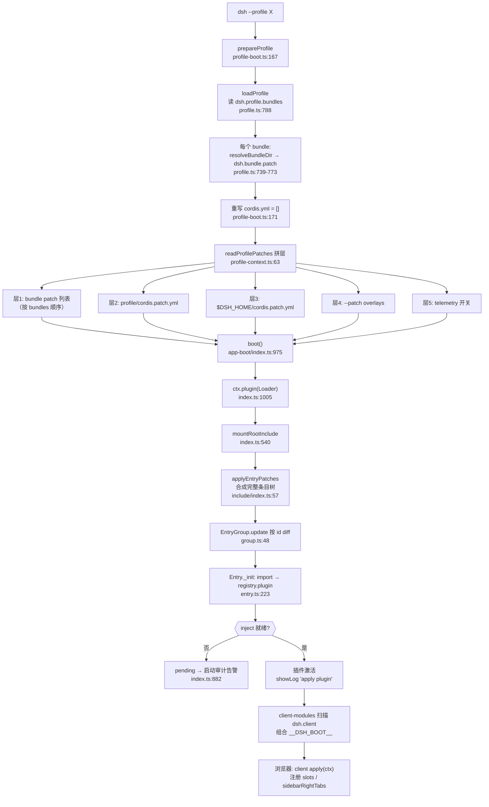

# 插件开发体系研究笔记

> 分析对象：`/Users/bytedance/codes/open-source/deepseek-harness`（DeepSeek Harness monorepo）。
> 所有 `路径:行号` 锚点均经 `rg`/`sed` 实际读源码验证。相对路径以该仓库根为基准。

## 一句话定位

DSH 的插件体系是「**cordis 运行时（服务注入 + 事件）** 之上的 **声明式组合层**」：一个 profile 目录声明一串 bundle（npm 包），每个 bundle 贡献若干 patch 文件，patch 以 id 寻址对一棵「插件条目树」做 insert/覆盖/禁用，最终由 vendored 的 `@deepseek-ai/cordis-plugin-loader` 逐条 import 并激活——代码包是 npm 包，装配图是 YAML，合并语义集中在 `applyEntryPatches` 一个函数里。

## 关键文件地图

| 层 | 文件 | 职责 |
|---|---|---|
| CLI 入口 | `apps/cli/src/bin.ts:26-77` | 解析 argv，按 mode 分发到 profile/plugin/dump-config |
| Profile 装配 | `apps/cli/src/profile-boot.ts:244-326` | `runProfile`：代理、信号、fail-loud、调 `boot` |
| Profile 读取 | `packages/boot/app-boot/src/profile.ts` | profile/bundle 发现、`dsh.profile.bundles` 解析（:739-805） |
| patch 层合成 | `packages/boot/app-boot/src/profile-context.ts:63-75` | bundle 层 + 用户层 + home 层 + overlay + telemetry 的拼接顺序 |
| 启动核心 | `packages/boot/app-boot/src/index.ts:975-1041` | `boot()`：建 Context、挂 Loader、mount 根 Include、审计 |
| 根 Include | `packages/boot/app-boot/src/index.ts:540-582` | `mountRootInclude`：注册 `cordis:include`/`cordis:group` 内建并创建根条目 |
| Loader | `vendor/loader/src/index.ts:77-209` | `Loader extends EntryTree`：条目树 + 模块导入 + 日志 |
| 条目 | `vendor/loader/src/config/entry.ts:43-238` | `Entry`：id/disabled/update/init 全生命周期 |
| 树/组 | `vendor/loader/src/config/tree.ts`、`config/group.ts` | `EntryTree`（import/create/write）、`Group` 嵌套组插件 |
| 隔离 | `vendor/loader/src/config/isolate.ts:26-71` | `intercept`/`isolate` 的 Realm 符号重写 |
| patch 算法 | `vendor/include/src/index.ts:57-127` | **唯一的合并语义实现** `applyEntryPatches` |
| 文件 Include | `vendor/include/src/index.ts:159-341` | YAML/JSON 文件背书的 EntryTree，支持热重载 |
| `!!js` 求值 | `vendor/loader/src/config/utils.ts:5-22` | `evaluate`/`interpolate`，`with(ctx) eval(expr)` |
| 清单类型 | `packages/util/package-manifest/src/types.ts:30-78` | `dsh.bundle`/`dsh.profile`/`dsh.client` 字段定义 |
| client 加载 | `packages/client/modules/src/index.ts:1-23` | 扫描 host 树中声明 `dsh.client` 的包，组合 `window.__DSH_BOOT__` |
| preset 声明 | `packages/preset/agent-preset/src/index.ts:12-30` | 一行 YAML 即一个 preset 的声明插件 |
| preset 注册表 | `packages/preset/agent-preset-registry/src/index.ts:52-122` | 注册、激活、默认选择与切换 |
| bundle 示例 | `packages/bundle/base`、`packages/bundle/web-app` | 官方基础/ Web bundle 及其 presets/*.patch.yml |
| 三方插件示例 | `packages/experimental/client-ui-voice-input`、`learning/plugin/dsh-learning-hub` | host/client 两半结构的真实样例 |
| 文档 | `docs/cordis-primer.zh.md:43-45`、`docs/subsystems/extensions.zh.md`、`docs/subsystems/boot.zh.md`、`docs/development.zh.md:149-181` | loader 概念、扩展子系统、profile 管理、开发流程 |

## 核心机制详解

### 1. Profile：一个目录 + 两个文件

Profile 就是 `$DSH_HOME/profiles/<name>/` 下的目录（`profile.ts:36-40`），初始化时只写三件东西（`profile.ts:261-280`）：

- `package.json` —— `dsh.profile.bundles` 声明有序 bundle 列表（`profile.ts:268-274`）；
- `cordis.patch.yml` —— 用户自己的 patch 层（模板注释见 `profile.ts:237-241`）；
- `pnpm-workspace.yaml` —— hoisted 链接器，让树外插件共享安装内单份 cordis（`profile.ts:243-252`）。

内置模板把常用组合钉死（`profile.ts:179-195`）：

```ts
export const PROFILE_TEMPLATES: Record<string, ProfileTemplate> = {
  acp:      { bundles: ['@deepseek-ai/dsh-base', '@deepseek-ai/dsh-acp-app'] },
  web:      { bundles: ['@deepseek-ai/dsh-base', '@deepseek-ai/dsh-web-app'] },
  headless: { bundles: ['@deepseek-ai/dsh-base', '@deepseek-ai/dsh-headless'] },
  sdk:      { bundles: ['@deepseek-ai/dsh-base', '@deepseek-ai/dsh-sdk-app'] },
  'sdk-minimal': { bundles: ['@deepseek-ai/dsh-sdk-minimal'] },
}
```

关键设计：profile 里的 `cordis.yml` **每次启动被重写为空数组**（`profile-boot.ts:81-85, 171`），整棵树完全由 patch 层合成——注释明确说这是防止 loader 的写回把合成结果烤进根文件导致下次启动重复插入。

### 2. Bundle：一个声明 `dsh.bundle.patch` 的 npm 包

清单类型（`packages/util/package-manifest/src/types.ts:69-78`）：

```ts
export interface DshBundleManifest {
  /** 一个 patch 文件路径，或按序应用的有序列表 */
  patch: string | string[]
}
export interface DshProfileManifest {
  bundles?: string[]   // profile 目录声明的有序 bundle 层列表
}
```

`dsh-base` 只声明一个文件（`packages/bundle/base/package.json:31-35`）；`dsh-web-app` 声明五个、按序应用（`packages/bundle/web-app/package.json:42-50`）：主 patch 在后、四个 preset patch 随后。bundle 解析是「安装优先、profile 其次」的双锚点（`resolveBundleDir`，`profile.ts:713-724`）——这保证 `@deepseek-ai/dsh-base` 永远来自当前 dsh 安装本身。加载失败/不兼容的 bundle 被跳过并记录原因，不致命（`profile.ts:750-767`）。

### 3. patch 合并语义：`applyEntryPatches`

整个体系的合并语义只有一个实现（`vendor/include/src/index.ts:57-127`），挂载和 `dsh --dump-config` 共用，保证「看到的 = 启动的」：

```ts
for (const patch of patches) {
  const { id, insert, name, ...overrides } = patch
  if (insert) {
    if (id) { const target = entryMap.get(id)
      if (!target.group) { warn('patch insert: entry %C is not a group', id); continue }
      target.config.push(...insert)          // :79-91 插进指定 group
    } else { data.push(...insert) }          // :92-93 插到根列表末尾
    buildMap(insert)                         // :100 插入的行立即可被后续 patch 寻址
    continue
  }
  if (!id) { warn('patch: id is required'); continue }                    // :104-107
  const target = entryMap.get(id)
  if (!target) { warn('patch: entry %C not found', id); continue }        // :109-113
  if (name && name !== target.name) { warn(...); continue }               // :115-118 name 防呆
  for (const [key, value] of Object.entries(overrides)) target[key] = value // :120-123 整键覆盖
}
```

四条要点：

1. **id 匹配**：非 insert patch 必须带 `id`；匹配不到只告警跳过，不报错（`index.ts:109-113`）——同一 overlay 可跨多个 surface 复用。
2. **insert**：无 `id` 追加到根列表；有 `id` 则要求目标是 `group: true` 的行并追加进其 `config` 数组。插入的行**当层即可**被后面的 patch 寻址（`buildMap(insert)`，`index.ts:95-100`）。
3. **config 合并 = 整体替换**：`config` 键被新值整个覆盖，不做深合并（`index.ts:120-123`，`dsh-base` patch 头注释也强调这一点，`packages/bundle/base/cordis.patch.yml:6-10`）。想改 preset 内某行配置，必须像 daimon-web 的用户层那样整段重述（见 `$DSH_HOME/profiles/daimon-web/cordis.patch.yml:1-6`）。
4. **disabled**：作为普通覆盖键写入；其值可以是 `!!js` 表达式（见下节）。`disabled` 沿祖先链生效——任何一级祖先禁用即禁用（`entry.ts:76-85`），且 group 行自身永不被禁用（`entry.ts:77-78`）。

### 4. `!!js` 表达式：两个求值时机

`!!js` 由 include 的 YAML schema 解析为 `{ __jsExpr }` 节点（`vendor/include/src/index.ts:9-23`），求值是 `with(ctx) { eval(expr) }`（`vendor/loader/src/config/utils.ts:5-9`）。但两种字段的求值上下文不同：

- **`disabled`**：在 **loader 上下文**（根作用域）求值，可访问 `ctx.get(...)`、`process`（`entry.ts:91-99` 经 `evaluate(this.ctx, ...)`，entry 的 ctx 原型链挂到 loader 根）。典型用法：平台门控与存在性门控——
  `disabled: !!js process.platform === 'win32'`（`presets/standard.patch.yml:23`）、
  `disabled: !!js "!ctx.get('profileContext')"`（`base/cordis.patch.yml:22`）。
- **`config` 内的 `!!js`**：在**该插件自己的上下文**里、于其声明的 inject 就绪后惰性插值（`vendor/loader/src/index.ts:104-113` 的 `internal/config` 全局钩子调 `interpolate`；求值上下文即插件 ctx，可用 `ctx.someService`、`dshHomePath(...)`）。Group/Include 这些「树载体」的配置保持字面不插值（`index.ts:107-111`、`group.ts:77`），因为嵌套行的表达式属于各行自己的 fiber。

官方文档一句话总结见 `docs/cordis-primer.zh.md:43-45`。

### 5. group 与 isolate

- `cordis:group` 是 loader 内建插件（注册于 `mountRootInclude`，`packages/boot/app-boot/src/index.ts:564`；实现在 `vendor/loader/src/config/group.ts:75-90`）：一行 `group: true` + `config: [子条目...]` 挂载一棵嵌套条目组，子条目 id 以 `父id:子id` 复合（`tree.ts:8`、`entry.ts:67-73`）。
- `isolate` 把指定服务名重写成 entry 局部（`#id` 后缀）或命名共享（`@label` 后缀）的符号（`isolate.ts:48-68`），让同一服务在不同组里各有实例——例如 minimal preset 里 `persistent-shell` 组隔离 `terminals`（`presets/minimal.patch.yml:17-22`），session-search bundle 组隔离 `sessionQuery`（`packages/experimental/session-search/cordis.patch.yml:3-6`）。`intercept` 则声明对依赖服务的配置拦截（`isolate.ts:5-9`）。

### 6. Agent preset：声明式能力集 + 注册表切换

preset 不是 loader 层的概念，而是一个**普通 cordis 插件** `dsh-agent-preset`：它的 config 就是一份 preset 定义（`packages/preset/agent-preset/src/index.ts:12-30`）：

```ts
export default class AgentPreset {
  static inject = ['agentPresets']              // :13 等注册表服务
  static readonly [EntryGroup.key] = true       // :15 子行表达式保持字面
  async* [Service.init]() {
    yield await this.ctx.agentPresets.register(this.config)  // :27-29 启动即注册
  }
}
```

web-app bundle 用四个 patch 文件各插入一行 preset 声明（`standard`/`ptc`/`minimal`/`cordis`），例如 `presets/standard.patch.yml:4-10`：

```yaml
- insert:
    - id: preset-standard
      name: '@deepseek-ai/dsh-agent-preset'
      config:
        id: standard
        order: 1
        plugins: [...]     # 一整棵 EntryOptions 列表，Agent 作用域的组合
```

注册表 `AgentPresetRegistry`（`agent-preset-registry/src/index.ts:52-122`）收到定义后立即在独立 scope 里 `mountPreset` 激活成一棵子树（`:103-122`），失败记入 `broken` 而非拖垮启动。默认 preset 由 config `default` + 可写的 `selectedDefault`（volatile）决定（`preset.ts:13-18`、`index.ts:75`）；会话级切换经 `agent-preset/selected` 会话事件广播（`index.ts:69-71`）。用户层 patch 可按 id `preset-standard` 整体替换其 `config.plugins` 来裁剪 preset——daimon-web 的用户层就是这么干的（见上节第 3 点）。

### 7. host 插件 vs client 插件

**host 插件**：Node 侧，loader 条目 `name` 指向包主入口，导出 cordis 插件（函数 `apply(ctx)` 或 `Service` 子类），`inject` 声明的是**服务名**（如 `['webServer']`、`['skills']`——`skill-office/src/index.ts:35`）。可用的注入面是整个 host 服务目录（`ctx.loader`、`ctx.sessions`、`ctx.llm`、`ctx.webServer`…）。

**client 插件**：浏览器侧，同一个 npm 包通过两个字段成为「双面包」：

- `exports["./client"]` 指向打包好的浏览器 bundle（`client-ui-voice-input/package.json` exports 段）；
- `package.json.dsh.client` 声明加载元数据（校验在 `packages/client/modules/src/client/manifest.ts:162-173`）：

```jsonc
"dsh": { "client": {
  "platform": "web",          // 必填
  "inject": [/* 包名，映射到 client 侧服务 */],
  "external": ["@deepseek-ai/dsh-api-gateway/client"],  // 从模块表取的共享模块
  "immediately": true          // 可选：立即加载而非按需
} }
```

host 的 client-modules 服务扫描 host loader 树中声明了 `dsh.client` 的包（增量扫描，模块头注释 `packages/client/modules/src/index.ts:1-23`），组合成 `window.__DSH_BOOT__` 入口图；声明了 `dsh.client` 却没有 `./client` 导出会直接报组合错误（`index.ts:847`）。注意 client 的 `inject` 写的是**包名**而非服务名，由 client 运行时映射为 `ctx.slots`、`ctx.sidebarRightTabs` 等 client 服务。

**client 的 UI 扩展点**：`ctx.slots` 的命名 seat（如 `sidebar.right.pane.tab`、`conversation.input.activity`、`shell.overlay`）+ 右栏 tab 类型注册表 `ctx.sidebarRightTabs`。真实例子（`packages/client/ui-schedule/src/client/index.ts:155-163`）：

```ts
ctx.effect(() => ctx.sidebarRightTabs.register(scheduleTaskDefinition(t)), '...')
ctx.slots.inject('sidebar.right.pane.tab', () => ctx.slots.register(
  { name: 'sidebar.right.pane.tab', key: tabId }, BodyComponent))
```

「host 标记 + client 实现」可以同包共存：voice-input 的 host 半是空 `apply`（`client-ui-voice-input/src/index.ts:1-3`），浏览器半在 `src/client/index.ts:13-15` 导出 `apply(ctx)`。

## 端到端调用链：`--profile daimon-web` 启动到 learning-hub 激活

以真实 profile `daimon-web`（其 bundle 列表含本地三方 bundle `@local/dsh-learning-hub`，见 `$DSH_HOME/profiles/daimon-web/package.json`）逐跳追踪：

1. `apps/cli/src/bin.ts:76-77` — `import.meta.main` 触发 `runCli()`
2. `apps/cli/src/bin.ts:29` — `parseDshArgs(process.argv.slice(2), ...)` 得 `mode: 'profile'`
3. `apps/cli/src/bin.ts:33-42` — 动态 `import('./profile-boot.ts')`，调 `runProfile({ profile: 'daimon-web', ... })`
4. `apps/cli/src/profile-boot.ts:249-252` — 先装环境代理（Node fetch 不读 proxy env）
5. `apps/cli/src/profile-boot.ts:265-267` → `composeProfile()`（`:197-209`）
6. `apps/cli/src/profile-boot.ts:203` → `prepareProfile('daimon-web', ...)`（`:167-173`）→ `loadProfile`（`packages/boot/app-boot/src/profile.ts:788-805`）→ `loadProfileDirectory`（`profile.ts:739-773`）：读 `dsh.profile.bundles`，逐个 `resolveBundleDir`（`profile.ts:713-724`）、读各 bundle 的 `dsh.bundle.patch` 并 `loadOverlayPatches` 解析成 `ProfileLayer[]`；再读 profile 自己的 `cordis.patch.yml`
7. `apps/cli/src/profile-boot.ts:171` — 把 profile 的 `cordis.yml` 重写为空数组 `[]`
8. `apps/cli/src/profile-boot.ts:206` — `createRuntimeResolution`（`profile.ts:448-481`）：BFS 依赖图算出安装+profile 两作用域的包表
9. `apps/cli/src/profile-boot.ts:296` — `boot(NAME, rootConfig, readProfilePatches(...), prepare)`
10. `packages/boot/app-boot/src/profile-context.ts:63-75` — patch 层按序拼平：**bundle 层（按 bundles 顺序，learning-hub 的 `cordis.patch.yml` 在其中）→ profile 用户层 → `$DSH_HOME/cordis.patch.yml` → `--patch` overlay → telemetry 开关**
11. `packages/boot/app-boot/src/index.ts:994` — `const ctx = new Context()`
12. `index.ts:1005` — `await ctx.plugin(Loader)`（Loader 构造 `vendor/loader/src/index.ts:89-169`，挂上 `internal/config` 插值、自处置写回等全局钩子）
13. `index.ts:1006` → `prepare` 回调（`profile-boot.ts:296-312`）：`hostCtx.provide('profileContext', ...)`（:298）、`hostCtx.plugin(PluginPackages, { resolution })`（:302-304，安装运行时模块拦截 `profile-resolution/service.ts:66-76`）、`provideCmdline`（:307）
14. `index.ts:1008` → `mountRootInclude`（`:540-582`）：注册 `cordis:include`/`cordis:group` 内建（:546, :564），以 `{ id: 'include', name: 'cordis:include', config: { path, patches } }` 创建根条目（:577-581）
15. `vendor/loader/src/config/entry.ts:210-238` — 根 Entry `init()`→`_init()`：`tree.import('cordis:include')` 走内建（`tree.ts:113-115`），`registry.plugin(plugin, config)` 启动
16. `vendor/include/src/index.ts:245-263` — `Include[Service.init]`：读 `cordis.yml`（空数组）→ `applyPatches` → `root.update(...)`；这里 `applyEntryPatches`（:57-127）把所有 patch 层一次性合成出完整条目树，learning-hub 的 insert 行在此落位
17. `vendor/loader/src/config/group.ts:48-65` — `EntryGroup.update` 按 id diff，对新行 `create()`
18. `vendor/loader/src/config/entry.ts:223-238` — learning-hub 条目 `_init()`：`import('@local/dsh-learning-hub')`（经 PluginPackages 拦截解析到 profile node_modules 的 file: 链接）→ `unwrapExports`（`loader/index.ts:201-208`）→ `registry.plugin(plugin, config)` 挂载 fiber；其 `inject: ['webServer']`（`learning/plugin/dsh-learning-hub/index.js:17`）等待 webServer 服务就绪后激活，`apply` 里注册 `/__learning-hub` HTTP API
19. `packages/client/modules/src/index.ts:1-23` — client-modules 扫描到该包声明 `dsh.client`，把 `./client` 加入 `__DSH_BOOT__` 图；浏览器加载后 `client.js:255-272` 的 `apply(ctx)` 注册三个右栏 tab
20. `packages/boot/app-boot/src/index.ts:1011-1013` — `ctx.get('loader')?.await()` 等整树 settle，`auditStartupEntries`（:928-943）审计：required 条目失败则抛 `StartupError`，可选项失败仅告警
21. `apps/cli/src/profile-boot.ts:314-318` — fiber ACTIVE 且 loader 在 → `appReady.commit()`，启动完成

## 最小插件模板（host + client，可直接抄）

以真实三方插件 `@local/dsh-learning-hub`（`learning/plugin/dsh-learning-hub/`）为蓝本的最小骨架——一个 host service + 一个右栏 tab：

```
my-plugin/
├── package.json
├── cordis.patch.yml
├── index.js      # host 半
└── client.js     # 浏览器半（无构建步骤，直接 ESM）
```

**package.json** —— `dsh.bundle.patch` 让它可当 bundle 用，`dsh.client` 声明浏览器半：

```jsonc
{
  "name": "@local/my-plugin",
  "version": "0.1.0",
  "private": true,
  "type": "module",
  "exports": { ".": "./index.js", "./client": "./client.js" },
  "dsh": {
    "bundle": { "patch": "./cordis.patch.yml" },
    "client": {
      "platform": "web",
      "immediately": true,
      "inject": ["@deepseek-ai/dsh-client-ui-sidebar-right"]
    }
  }
}
```

**cordis.patch.yml** —— 作为 bundle 层被应用时插入 host 行：

```yaml
- insert:
    - id: my-plugin
      name: '@local/my-plugin'
      config:
        greeting: hello
```

**index.js（host）** —— 导出一个 cordis 插件；`inject` 等服务，`ctx.provide` 提供自己的服务：

```js
export const inject = ['webServer']          // 需要的服务名，就绪后才激活
export function apply(ctx, config) {
  ctx.provide('myHello')                     // 提供 hello service
  ctx.myHello = {
    greet: () => `${config.greeting ?? 'hello'} from my-plugin`,
  }
  // 也可借 webServer 暴露 HTTP API（learning-hub 的 /__learning-hub 模式）
  const dispose = ctx.webServer.register?.('/__my-plugin', (req, res) => {
    res.writeHead(200, { 'content-type': 'application/json' })
    res.end(JSON.stringify({ message: ctx.myHello.greet() }))
  })
  return () => dispose?.()                   // 返回 disposer，卸载时清理
}
```

**client.js（浏览器）** —— 经模块加载器注册，React 从模块表 `require`：

```js
window.__ModuleLoader__.load({
  id: '@local/my-plugin',
  factory(require) {
    const React = require('react')
    const h = React.createElement
    const TAB_ID = '@local/my-plugin/hello'
    function HelloBody() {
      return h('div', { style: { padding: 16 } }, 'Hello from my-plugin')
    }
    return {
      inject: ['slots', 'sidebarRightTabs'],   // client 侧服务名
      apply(ctx) {
        ctx.effect(() => ctx.sidebarRightTabs.register({
          id: TAB_ID, kind: 'my-hello', priority: 'extension',
          title: () => '你好',
        }), 'my-plugin: tab type')
        ctx.effect(() => ctx.slots.inject('sidebar.right.pane.tab',
          () => ctx.slots.register(
            { name: 'sidebar.right.pane.tab', key: TAB_ID }, HelloBody)),
          'my-plugin: tab body')
      },
    }
  },
})
```

**接入 profile**（两步）：

1. 在 `$DSH_HOME/profiles/<name>/package.json` 的 `dependencies` 加 `"@local/my-plugin": "file:/abs/path/to/my-plugin"`，并把 `"@local/my-plugin"` 追加进 `dsh.profile.bundles` 末尾（在目标 profile 目录跑一次 `pnpm install` 建立链接）；
2. 重启 profile。想先快速验证可用 `dsh --profile <name> --patch ./cordis.patch.yml`（overlay 方式，无需改 bundle 列表），或先 `dsh --profile <name> --dump-config` 看合成结果是否包含你的行。

## 设计权衡与常见坑

1. **「空根 + 全 patch 合成」换可组合性，代价是心智间接层**。`cordis.yml` 恒为 `[]`（`profile-boot.ts:81-85`），一切靠 patch 层叠加——好处是 bundle 可随意组合、用户层永远最后赢；代价是你不能直接「看」最终配置，必须 `dsh --profile X --dump-config`（`apps/cli/src/dump-config.ts:1-7`）。**坑**：patch 匹配不到 id 只 warn 不报错（`include/index.ts:109-113`），拼错的 id 静默无效——改完先 dump 确认。
2. **config 是整体替换不是深合并**（`include/index.ts:120-123`）。想调 preset 里一个工具的超时，得在用户层把该行（甚至整个 preset 的 `config.plugins`）完整重述——daimon-web 的用户层因此长达数百行。**坑**：只写差异键 = 丢掉其余所有键。
3. **`!!js` 有两个求值上下文**：`disabled` 在 loader 根作用域（拿不到插件自己的服务），`config` 内的在插件自身 ctx、inject 就绪后求值（`loader/index.ts:104-113`、`entry.ts:91-99`）。**坑**：在 `disabled` 里引用插件级服务得到 `undefined`；在树载体（Group/Include/AgentPreset）的 config 里写表达式不会当场求值——它们属于嵌套行（`loader/index.ts:107-111`）。
4. **激活失败去哪看**：启动期——stderr 摘要 + `$DSH_HOME/logs/startup-*.log` 完整报告（`apps/cli/src/startup-diagnostics.ts:34, 58-59`），required 条目失败直接 `StartupError`（`app-boot/index.ts:928-943`），可选条目失败打印 `dsh: warning: N entries did not activate`（`:873-886`）并附「pending (waiting for services: …)」清单；运行期——loader 日志 `apply/reload/unload plugin <name>`（`loader/index.ts:181-184`）。
5. **两类高频报错**：(a) **inject 缺失**——插件声明了没人提供的服务，fiber 停在 pending，启动审计的 `inactiveDiagnostic` 会列出 missing services（`app-boot/index.ts:882-886`）；修复是确认提供方条目没被禁用/跳过，或给消费方加 `disabled: !!js "!ctx.get('xxx')"` 门控。(b) **config schema 校验失败**——cordis 在插件启动前用 schemastery 同步校验 config，不合法抛 `ValidationError`（`vendor/cordis/src/fiber.ts:50-62`），报文含具体 issue 路径；先 `dsh --profile X --dump-config-schema`（`bin.ts:65-68`）查声明的 schema 再改 YAML。
6. **bundle 解析「安装优先」**（`profile.ts:713-724`）：同名包在 profile node_modules 里有一份时，官方 bundle 仍取安装内的——调试自己 fork 的 `dsh-base` 不会生效，必须换包名。

## 教学建议（入门向）

1. **先跑通再读码**：`pnpm run build` 后 `pnpm dsh --profile headless "..."`（`docs/development.zh.md:149-167`），再用 `dsh --profile web --dump-config | less` 把合成树读一遍——dump 输出带每层来源注释，是理解分层最快的方式。
2. **按「配置即数据」的顺序学**：先只看 `EntryOptions` 五个字段（`entry.ts:10-23`）和 `applyEntryPatches`（30 行核心），再看 Entry 生命周期，最后才碰 isolate/intercept。loader 全包仅约 1000 行，值得通读。
3. **用 overlay 做实验**：不要一上来改 bundle；`--patch ./try.yml` 是零成本的 insert/disable 实验场，配合 `--dump-config` 即时验证合并结果。
4. **对照样例抄结构**：host-only 学 `skill-office`（函数插件 + `inject` + schemastery Config），双面包学 `dsh-learning-hub`（无构建、手写 ESM client）或 `client-ui-voice-input`（tsdown 构建 + React）。
5. **preset 是第二棵树**：理解「loader 树管进程，`agentPresets` 管 Agent 作用域组合」的二分后，再读 `agent-preset-registry/src/mount.ts` 的 `mountPreset`。

## 建议测验题（5 题选择，含答案解析）

**Q1.** `dsh --profile web` 启动时，patch 层的应用顺序是？
A. 用户层 → bundle 层 → `--patch` overlay
B. bundle 层（按 `dsh.profile.bundles` 顺序）→ profile 用户层 → `$DSH_HOME/cordis.patch.yml` → `--patch` overlay → telemetry 开关 ✅
C. `--patch` overlay → bundle 层 → 用户层
D. 只应用 bundle 层，用户层需手动 include
**解析**：`profile-context.ts:63-75` 的拼接顺序；home 层刻意高于 profile 层（机器级偏好全局生效），telemetry 开关最后压栈（`resolveTelemetryPatch`，`:52-55`）。

**Q2.** 用户 patch 写了 `- id: nonexist\n  disabled: true`，启动会？
A. 抛错退出  B. 忽略该文件其余 patch  C. 警告并跳过这一条，其余照常 ✅  D. 创建空条目再禁用
**解析**：`applyEntryPatches` 匹配不到 id 只 `warn` + `continue`（`include/index.ts:109-113`）——设计意图是同一 overlay 可跨 surface 复用，但代价是拼错 id 静默无效。

**Q3.** patch 对某行的 `config` 如何合并？
A. 深合并  B. 按键浅合并  C. 整体替换 ✅  D. 拒绝修改
**解析**：`include/index.ts:120-123` 直接 `target[key] = value`；`dsh-base` patch 头注释（`base/cordis.patch.yml:6-10`）明确「整段替换」，所以 mode 相关配置必须每层完整重述。

**Q4.** 一个包声明了 `dsh.client` 但 `exports` 没有 `"./client"`，后果是？
A. 仅浏览器功能缺失，无报错  B. client-modules 报组合错误 ✅  C. 自动回退到主入口  D. host 半也无法激活
**解析**：`packages/client/modules/src/index.ts:847`——双面声明必须成双；这是扫描 host 树组合 `__DSH_BOOT__` 时的硬校验。

**Q5.** 把 web profile 的默认 agent preset 从 standard 换成 minimal，正确机制是？
A. 删掉 `presets/standard.patch.yml` 文件
B. 改注册表 config 的 `default`（部署默认）或 `selectedDefault`（用户设置，volatile）✅
C. 在 loader patch 里 `disabled` 掉 `preset-standard` 行
D. 重排 `dsh.profile.bundles`
**解析**：`agent-preset-registry/src/preset.ts:13-18` + `index.ts:75`：`defaultId = selectedDefault.get() ?? config.default`；禁用声明行只会让该 preset 从花名册消失，并不改变默认选择。

## Mermaid 图草案（profile/bundle/patch 合成流程）


